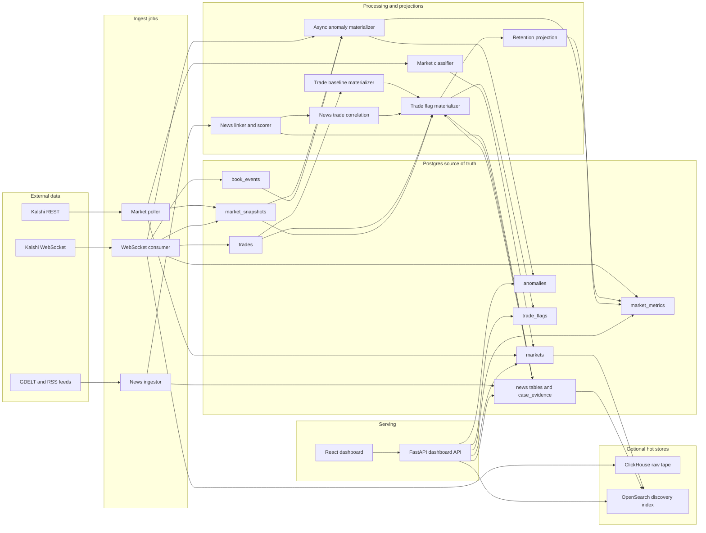
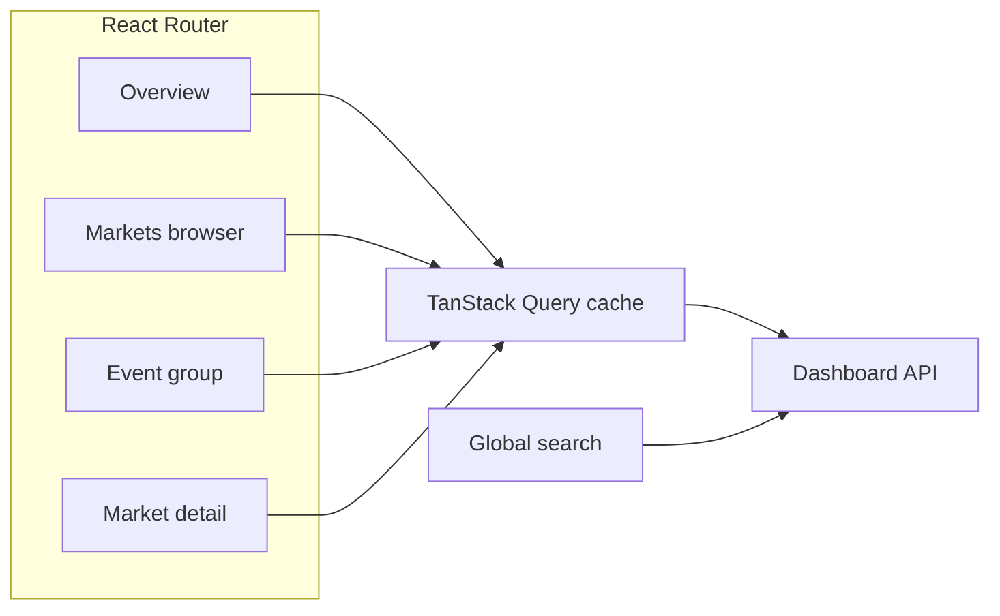
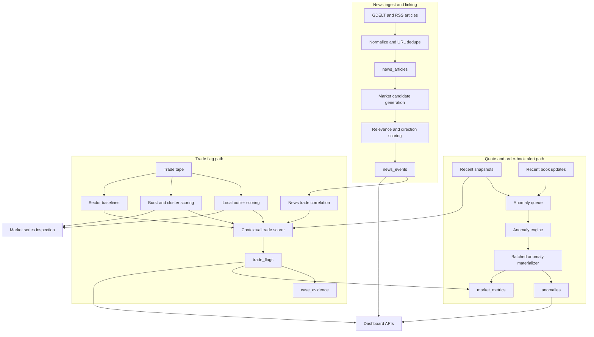

# Prediction Market Surveillance

**What this is:** A backend (plus a small web UI) that ingests public Kalshi data, stores control-plane/projection data in Postgres, can batch retained raw event tape into ClickHouse, and highlights **unusual** quotes, trades, and order-book *activity* — without access to who traded (public data only).

**Glossary (terms used in the UI and code)**

| Term | Meaning |
|------|---------|
| **Market contract** | One tradeable Kalshi ticker. A single Kalshi event can have many contracts, such as different dates, thresholds, or outcomes. |
| **Event group** | Contracts sharing the same Kalshi `event_ticker`. The event page groups them for comparison; trades and flags remain contract-specific. |
| **Active/open market** | A market still open or active and not past `close_time`. Historical markets are retained for post-mortem review but are separated from live monitoring panels. |
| **Watch priority** | The classifier's `manipulability_prior` bucket. It means "worth watching because this type of market may react to information"; it is not evidence of suspicious trading. |
| **Snapshot** | A stored ticker update: best bid/ask, last price, volume, open interest, and liquidity when available. |
| **Trade print** | One public execution from Kalshi's trade tape: price, contracts, side, event time, and ingest time. |
| **Estimated dollars** | `contracts * side price` for one trade print. It is estimated notional paid for contracts, not profit/loss or account exposure. |
| **Local trade outlier** | A market-detail score for a print versus that contract's recent tape: size, price jump, and clustering. It helps pick prints to inspect; it is not a durable alert by itself. |
| **Top trade flag** | A durable `trade_flags` row that combines local tape outlier score with context such as sector baselines, price impact, follow-through, sibling-market movement, market priority, and news timing. |
| **Alert history** | Market-level quote, volume, spread, and order-book rule rows stored in `anomalies`. The overview calls these **Market activity alerts**. They are separate from trade-specific flags. |
| **Order-book update** | A retained L2 snapshot level or delta. Low-value book noise can be dropped or compacted by the retention policy. |
| **News kept** | Deduped article metadata saved from GDELT and RSS/Atom sources: title, URL, timing, source, summary/entities when available, and scoring components. Full raw article bodies are not the core data product. |
| **News-linked signal** | A linked article/market row whose relevance, YES/NO direction, and trade timing clear display thresholds. It suggests something to review, not causality. |
| **OpenSearch** | Optional fuzzy search and suggestions over markets and stored news. Postgres remains the source of truth and the API falls back to Postgres search when OpenSearch is down. |
| **ClickHouse** | Optional hot raw store for retained high-volume trades, quote changes, and L2 events. The dashboard should read compact Postgres projections and flags first. |

**Pattern targets (long-term)** Informed flow, thin-liquidity moves, order-book games, and cross-market effects — with realistic limits (e.g. no wash-trading *proof* without account ids).

1. Falsifiable rules and per-market baselines (not one global “magic number” for all markets).  
2. **Append-only** event storage so we can re-run rules on history.  
3. **Resolution** as a weak label for “did price lean the right way before the outcome?” (future work; not the main focus today).

This README is updated when behavior or structure changes in a non-trivial way.

---

## 2. System Architecture

### Component diagram



**Architecture in plain English:** Postgres is the system of record for market metadata, read projections, flags, and cases. ClickHouse is optional hot raw storage for retained high-volume tape and L2 events. The WebSocket consumer processes broadly but only stores raw detail when the retention policy says it is worth keeping. The dashboard reads mostly from projections and flags, not from every raw event.

**Core tradeoff:** this is a surveillance system, not a data lake. We prefer compact evidence rows, baselines, and case windows over storing every Kalshi tick forever. That keeps costs bounded while preserving the detail needed to explain a flag.

### Frontend (pages and data)



**Price chart (market detail):** `frontend/src/components/PriceChart.tsx` uses an **area** series with `LineType.Curved` and a light gradient under the line. The curve between trade times is a spline for readability, not a claim that the contract transacted at intermediate prices (public tape is discrete). Volume remains a per-trade histogram below.

**URL state:** search params on `/markets` hold filters and sort so links are shareable. **Event grouping:** `GET /api/dashboard/events/{event_id}` (Kalshi `event_ticker` = `markets.event_id`) lists all leg contracts; the SPA route `/events/:eventId` shows the same. **Default list sort** `surveillance_urgency` puts markets with stored rule flags above “quiet” high-prior names. **First paint / Overview:** the home page uses a **single** `GET /api/dashboard/overview` to avoid four back-to-back JSON round-trips; cold loads still pay for the **first** JS download (Vite chunk includes Recharts) and the **first** run of several SQL counts / `GROUP BY`s on Postgres after an idle period.

**Pipeline health:** `GET /api/dashboard/pipeline-health` returns a small heartbeat/freshness/count snapshot for API, market hydration, WS trades, news ingest, news links, news/trade correlations, trade flags, quote/book anomalies, the retention/storage-tier projection, and storage guardrails. The Overview header renders this as a compact expandable **Pipeline health** widget with latest heartbeat, last success, row count, and last error when available. The dots represent pipeline components: some are long-running processes, but others are jobs, materializers, or DB projections, not standalone services.

**Search/discovery:** `GET /api/dashboard/search?q=...&scope=all|markets|news` searches hydrated markets and stored news. OpenSearch is the fast fuzzy/prefix path and powers the global header search; if OpenSearch is unavailable or the index has not been rebuilt, the endpoint falls back to Postgres plus the existing market-news profiles. That fallback is deliberately useful for sparse news: a market detail page with no exact stored link can still show search-backed related headlines and linked markets.

**Active vs historical markets:** Dashboard list/ranking endpoints accept `market_scope=active|historical|all` and default to `active`. Active means an open/active market that is not past `close_time`; historical means closed/finalized/settled or past-close. Historical markets stay queryable for post-mortems, so suspicious behavior can still be reviewed without mixing resolved contracts into the live monitoring view.

**Storage guardrails:** `GET /api/dashboard/storage-health` reports Postgres database/table sizes, local disk pressure, ClickHouse table/disk usage when reachable, and OpenSearch index/disk usage when reachable. The pipeline health widget includes the same signal as **Storage guardrails** so disk pressure shows up before writes fail.

### News vs prices (read path)

`app/services/news_gdelt.py` centralizes the GDELT query string (title, optional subtitle in an **OR** group) and the date window. `GET /api/dashboard/markets/{id}/news?align=default|activity` returns `anchors` (last print time, last flag time, which window mode) plus articles for the detail UI.

`scripts/run_news_surveillance_pipeline.py` is the normal background path. Each cycle ingests global news, materializes contextual trade flags, then refreshes news/trade correlations. `scripts/ingest_news.py` remains a focused one-shot ingest helper. The default surveillance sweep uses broad GDELT themes plus 46 RSS/Atom feeds across official/regulatory, business, crypto, general-news, weather, and sports sources, with a 7-day lookback and per-feed diagnostics in the pipeline heartbeat. Articles are URL-deduped and only kept as market links when relevance scoring clears the threshold, so a flat article count can mean "duplicates or weak matches," not necessarily that ingestion is dead. If GDELT is blocked, slow, rate-limited, or down, the job fails open: it records the provider error, keeps RSS ingest working, and lets the rest of the surveillance pipeline continue. The trade flag scorer simply has less news context until the next successful ingest.

### Detection pipeline (backend)



**Per-trade `suspicion`** still appears in the series API for immediate inspection. Durable `trade_flags` are the persisted version: they combine local tape outliers, sector baselines, quote impact, follow-through, sibling-market moves, and news timing. Trade payloads also expose `trade_dollar_amount`, an estimated notional for the print (`contracts * side price`) used on the market detail and overview tables. **Chart markers** on the detail page are stored rule rows, not one marker per trade.

**What GDELT failure means:** it is not a blocker for quotes, trades, retention, or the dashboard. It only removes one score component: `pre_news_directional_move`. Existing flags still work from tape, sector, quote, and cross-market behavior. When news ingest succeeds later, the flag materializer can rerun and add the news-timing evidence.

### How the pieces interact (short)

- **REST poller / bootstrap** — cursor-swept market list; poller also runs the materializer each cycle. **Hydrator** — per-ticker REST for `status=unknown` stubs. **WS consumer** — one connection: `ticker`+`trade` and `orderbook_delta`; reads into a bounded queue, worker tasks update Postgres projections, and retained raw events go to Postgres, ClickHouse, or both depending on `KALSHI_RAW_BACKEND`.
- **Classifier** — four layers + `priorities.py` map; stamps `markets` on ingest. **Anomaly path** — `book_activity_signals` + last N snapshots → `anomaly_engine` (rolling z where possible) → `anomalies` rows. **Dashboard** — Vite/React reads `/api/dashboard/*`; dev uses Vite proxy; prod serves `frontend/dist` from FastAPI. **Kalshi auth** — RSA-PSS signing for REST and WS.

### Storage model

- **`markets`** — one row per market, keyed externally by `market_id` (Kalshi ticker). Owns `event_id`, status, open/close times, and the classifier output (`category`, `subcategory`, `manipulability_prior`, `classifier_tags`, `classifier_layer`, `classifier_rule`, `classifier_confidence`, `classifier_version`).
- **`market_snapshots`** — append-only time series of L1 quote + aggregates for a market (`yes/no bid/ask`, `last_price`, `volume_fp`, `volume_24h_fp`, `open_interest_fp`, `liquidity_dollars`).
- **`trades`** — append-only public-trade tape (`trade_id` unique, `taker_side`, `count_fp`, `yes_price_dollars`, `no_price_dollars`, event-time `ts`, ingest-time `received_at`). API responses derive estimated print dollars from these stored price and count fields.
- **`book_events`** — append-only order-book event log. Each row is one price level: snapshot rows (`is_snapshot=true`) carry the absolute level size in `size_fp`; delta rows carry a signed `delta_fp` (positive adds contracts, negative removes, zero removes the level). Stamped with `session_id` (per WS connection) and Kalshi's per-subscription `seq`. Idempotency is enforced by a unique constraint on `(session_id, seq, side, price_dollars)`.
- **`anomalies`** — materialized output of the anomaly engine per `(market, latest_snapshot_id)` with `score`, `severity`, `reasons`, JSON `signals`.
- **`market_metrics`** — compact serving projection keyed by `market_pk`: latest quote cents, volume/OI hints, trade/anomaly counters, storage tier, retention score/reasons, and dashboard scores. This is the first step toward serving market lists from tiny read models instead of raw tape scans.
- **`market_features_1m`** — 1-minute feature row shape for compact trade/quote/L2 summaries. In Postgres for now; ClickHouse has a matching `SummingMergeTree` target in `sql/clickhouse_kalshi.sql`.
- **`trade_flags`, `trade_baselines`** — durable contextual trade flags plus peer baselines by category/subcategory. The flag scorer combines local tape outliers with sector baselines, quote impact, follow-through, sibling-market behavior, linked news timing, and priority/near-resolution context.
- **`news_articles`, `market_news_profiles`, `news_events`, `case_evidence`** — scaffolding for global-first news ingest, article-to-market candidate links, pre-news trade scoring, and durable evidence bundles.
- **ClickHouse raw hot tables** — optional, configured by `KALSHI_RAW_BACKEND`. `kalshi_trades_raw`, `kalshi_quote_changes_raw`, and `kalshi_l2_events_raw` keep compact integer/event rows with short TTLs; durable cases should be promoted to `case_evidence` / object storage instead of keeping every raw tick forever.

### Tooling

- **Postgres** via SQLAlchemy 2 (`psycopg` driver) with **Alembic** migrations.
- **ClickHouse** is available in `docker-compose.yml` for high-volume raw tape and L2 event storage. Schema lives in `sql/clickhouse_kalshi.sql`; writes are batched with `JSONEachRow`.
- **OpenSearch** is available in `docker-compose.yml` for market/news discovery and suggestions. It is not the source of truth; rebuild it from Postgres with `scripts/rebuild_search_index.py`, and the API falls back to Postgres if it is down.
- **FastAPI / Uvicorn** for the API.
- **websockets** + **cryptography** for Kalshi WS auth and feed.
- **pytest**, **ruff**, **mypy** for tests and linting.
- **Vite 2.9 (not 4/5) + React 18 + TypeScript** for the frontend, with **Tailwind**, **TanStack Query**, **TanStack Table**, **TradingView lightweight-charts**, and **Recharts** — Vite 4+ requires **^14.18.0**; Vite 5 targets Node 18+ ESM. **Vite 2.9.18** runs on **Node ≥12.2** so 14.17.x and similar “almost LTS” runtimes do not need a system Node upgrade. See `frontend/package.json`.
- **Redis** is configured in `app/core/config.py` and is used as a best-effort shared cache for dashboard payloads, with in-process cache fallback if Redis is unavailable.

### Local dev workflow

Two processes side by side. The API serves JSON; Vite serves the frontend with hot-reload and proxies `/api/*` calls to the API.

For the full local surveillance stack, use the supervisor. It pins the API port, starts the selected pipeline components, writes logs under `.pipeline-logs/`, and restarts failed children with backoff:

```bash
.venv/Scripts/python -m scripts.run_pipeline --api-port 8000
# optional hot-reload frontend too:
.venv/Scripts/python -m scripts.run_pipeline --api-port 8000 --with-vite
```

The lower-level two-process workflow is still useful when you only want API/UI iteration:

```bash
# Terminal 1 — from repo root, with venv on PATH (API required for Overview)
# Use `python -m uvicorn` so the same interpreter as the project is used.
.venv/Scripts/python -m uvicorn app.main:app --reload

# If Windows returns **WinError 10013** on the default port, bind out of the
# "excluded" range — for example (then point Vite at the same port, next block):
# .venv/Scripts/python -m uvicorn app.main:app --reload --host 127.0.0.1 --port 8001

# Terminal 2 — frontend (one-time install, then dev server)
# The stack pins **Vite 2.9** so Node 12–**14.17** (inclusive) can run the
# dev server without hitting Vite 4’s floor (`^14.18.0`) or Vite 5’s
# Node 18+ ESM. If you are already on **Node 14.18+** or 16+, you may
# prefer a newer Vite; this repo values “works on the old Node the OS ships”.
cd frontend
npm install
# If Uvicorn is on :8001, create `frontend/.env.local` with:
#   VITE_DEV_API_TARGET=http://127.0.0.1:8001
npm run dev
# open http://localhost:5173
```

**Blank or white page in the browser:** A completely white/empty view usually means the JS bundle did not run (check **Network** for red `index.*.js` or `main.tsx` 404) or a runtime error ran before React could paint. Open **Console (F12)**. For **`npm run dev`**, the shell URL may not be 5173 if that port is busy — use the `Local: http://localhost:…` line Vite prints, and start the API on the port the Vite proxy targets (default 8000) so the Overview is not stuck on the error card. The SPA’s `index.html` includes a short boot line inside `#root` and `frontend/src/main.tsx` wraps the app in an error boundary so a render error shows a message instead of a blank screen.

If the dev server errors with **Cannot find module** under `vite/dist/node/chunks/dep-….js`, that is almost always a **broken or mixed `node_modules`** (e.g. half of Vite 5 left on disk while `package.json` pins Vite 2). Delete `frontend/node_modules` and `frontend/package-lock.json`, run `npm install` again, and ensure you are not invoking a **global** `vite` (the npm scripts call the local `node_modules/vite/bin/vite.js` explicitly).

For a production-shaped run, build the frontend once and serve everything from FastAPI:

```bash
cd frontend && npm run build && cd ..
.venv/Scripts/python -m uvicorn app.main:app
# open http://localhost:8000
```

If you don't have a current Node, the smoke setup can use a portable Node bundle in `tools/` (gitignored). Any **Node ≥12.2** matches Vite 2.9; use that bundle or your OS install.

---

## 3. Design decisions and changelog

This section tracks the architectural decisions actually present in the code, plus a chronological log of meaningful changes. It is updated whenever the code is updated.

### Current design choices

| Choice | Why | Tradeoff |
|--------|-----|----------|
| **Postgres for control plane, ClickHouse for retained raw tape** | Postgres stays good at metadata, projections, flags, and cases; ClickHouse is better for high-volume append-only event slices. | More moving parts, but raw storage can grow without making every dashboard query slower. |
| **Process broadly, retain narrowly** | Every in-scope event can update real-time state, but quiet markets do not deserve full raw retention. | Some raw detail expires or is never stored unless a market becomes interesting. We keep compact features and promote evidence windows when signals fire. |
| **Rule-based/contextual flags before a trained model** | The system needs explainable reasons now: sector p95/p99, price impact, follow-through, news timing, and cross-market behavior. | Less flexible than a learned model, but easier to debug, tune, and defend. A model can later use these same features. |
| **Global news ingest plus market linking** | News must be available before a user opens a market page, especially for pre-news trade timing. | External news is best-effort. If GDELT is unavailable, the system fails open and flags continue without that component. |
| **Durable case evidence, not infinite raw history** | The important output is a compact, replayable evidence bundle around suspicious windows. | Research queries over discarded raw noise are limited, but storage growth is controlled. |

- **Public data only, named-pattern surveillance.** No account-level data is available from Kalshi's public feed. The detector taxonomy in §1 was chosen so each pattern is either fully detectable from public data or explicitly scoped out (wash trading).
- **Two notions: priority vs evidence.** (1) **Watch priority** is the classifier's `manipulability_prior`: "is this the kind of market where an information leak is plausible?". (2) **Evidence** is something in our data: a market-level **alert history** row, a durable **top trade flag**, or a local trade outlier on the series response. The markets list default sort, `surveillance_urgency`, puts markets with alert history above quiet priority-only names. The `top_trade_flag` sort instead ranks by the highest single durable trade flag score for that market. Per-trade `suspicion` in the series API remains a local 0..10 outlier score over recent prints on that ticker. It is useful for choosing which leg to inspect, not a legal conclusion.
- **Append-only event tables.** `market_snapshots` and `trades` are append-only so detectors can be replayed deterministically against historical data when rules change.
- **Event time vs ingest time are stored separately.** `trades.ts` is the Kalshi `ts_ms` (the moment the trade executed); `trades.received_at` is when the row was inserted. Surveillance queries are event-time queries; `received_at` exists for clock-skew / pipeline-latency monitoring.
- **`Numeric`, not `float`, for prices and volumes.** Money- and contract-quantity-like fields are stored at exchange precision (`Numeric(12, 4)` for dollar prices, `Numeric(18, 2)` for `*_fp` quantities) to avoid binary-floating-point error. The SQLAlchemy ORM types those columns as **`Decimal` / `Decimal | None` in `app/db/models.py`**; JSON responses still convert with `float()` at the API boundary.
- **Idempotent ingest via `INSERT … ON CONFLICT DO NOTHING`.** Reconnects can replay messages. Trade ingest dedupes on `trade_id`; book-event ingest dedupes on `(session_id, seq, side, price_dollars)`. Either way, duplicates are a single cheap statement, not an exception path.
- **One WebSocket connection, multiple channels, multiple `subscribe` commands.** `consume_market_data_forever` opens one authenticated WS and sends two `subscribe` commands on it — one for `ticker` + `trade` (no market filter), one for `orderbook_delta` with explicit `market_tickers`. Two commands rather than one because the channels need different `params` shapes; one connection rather than two because we want a single auth handshake, single heartbeat, and a single dispatcher in the message loop.
- **Bounded WS ingest queue.** The socket reader no longer performs DB work inline. It puts decoded messages into an in-process bounded queue (`kalshi_ws_queue_size`, default 10k), and worker tasks (`kalshi_ws_worker_count`, default 4) run the synchronous handlers in threads. That gives explicit backpressure and keeps WebSocket reads from stalling on per-message database latency.
- **Per-connection `session_id` for the book stream.** Kalshi's `seq` is per-subscription and resets on reconnect, so it is not a globally stable identifier. We generate a UUID per WS connection and stamp it on every `book_events` row. Idempotency, gap detection, and replay all use `(session_id, seq)`; a new `is_snapshot=true` row inside a new `session_id` is the natural marker of a session boundary.
- **Selective `orderbook_delta` subscription, ranked by lifetime volume.** Unlike `ticker` and `trade`, the book channel requires explicit market tickers. The consumer takes either a configured `kalshi_book_market_tickers` list, or — when none is configured — picks the top `kalshi_book_market_limit` (default 50) markets by `volume_fp` (lifetime cumulative volume) from each market's most recent snapshot, with a `Market.updated_at desc` cold-start fallback when no snapshot has positive volume yet. Lifetime, not 24h, because the Kalshi WS ticker payload does **not** include `volume_24h_fp`, so a 24h ranker would silently exclude every market we've seen via WS — exactly the actively-trading set we care about. The set is resolved once per connection; updating it mid-session via `update_subscription` is deferred.
- **Lazy upsert of unknown tickers from the WS feed.** The `ticker` and `trade` channels are unfiltered, so the WS feed will emit messages for markets that are not yet in `markets` (Kalshi creates new BTC / sports markets continuously, and a one-shot REST bootstrap can be biased by Kalshi's alphabetical pagination). Rather than dropping those messages, `_get_or_create_market` does an idempotent `INSERT ... ON CONFLICT DO NOTHING` keyed on `markets.market_id` and re-selects, so every unknown ticker is auto-promoted to a stub `Market` row carrying `status='unknown'` as a sentinel. The REST poller is the single writer that hydrates the rest of the metadata (title, event_ticker, open/close times) on a later sweep. Orderbook handlers stay strict — by construction, anything we receive on `orderbook_delta` was a market we explicitly asked for, so an unknown ticker there would be a real bug rather than a discovery.
- **One row per price level on snapshots.** An `orderbook_snapshot` is expanded into N `book_events` rows in a single bulk `INSERT … ON CONFLICT DO NOTHING`. Uniform schema with delta rows means replays just walk events in order rather than branching on row shape.
- **Per-table replay-ordering indexes.** Each event table has a per-market access path tuned to its data, rather than one uniform composite. The dominant detector query is *"give me events for market M in order between t1 and t2"*; the right key for that query depends on whether the table's event-time column is reliable.
  - `trades` indexes `(market_pk, ts)`. `ts` (Kalshi's `ts_ms`) is non-null on every row and is what every detector joins on.
  - `book_events` indexes `(market_pk, id)` instead. Snapshot rows do not carry `ts_ms`, so `ts` is nullable; the autoincrement `id` is monotonic per insert and never null, which is what replays actually need.
  - The latest migration adds newest-first composite indexes for hot read paths: snapshots by `(market_pk, ts desc, id desc)`, trades by `(market_pk, ts desc, id desc)`, recent book events by `(market_pk, received_at desc)`, and anomalies by market/severity plus created time.
- **Unique external IDs as constraints.** `markets.market_id` and `trades.trade_id` are both indexed `UNIQUE`. Dedup is enforced by the database, not application logic.
- **Anomaly engine + book hints + persistence gate.** `analyze_market` uses rolling z-scores on spread, reference-price change, and volume delta when enough history exists; otherwise static fallbacks. `book_activity_signals` adds high order-book event rate and sustained cancel/pull hints from recent L2 activity. The async/batched materializer only keeps rows that clear the persistence floor and compacts continuing alerts instead of inserting on every anomalous snapshot. No full L2 reconstruction in RAM yet; churn heuristics only, so a deeper spoofing detector would rebuild the book from retained `book_events` or ClickHouse raw windows.
- **Per-trade outlier (API).** `trade_suspicion.py` scores each print vs a local window and returns **0..10** for the series response only; it does not write `anomalies`. The market-detail table labels this **Outlier** (not “suspicious trade”).
- **Burst / cluster (API, tape-only).** `trade_burst.py` measures dense same-side windows (default 30s) on the same ascending tape as the chart; the series response adds per-trade `cluster_0_10` and a `tape_cluster` summary. It is a behavioral cluster *hypothesis* — Kalshi’s public API does not expose account ids, so the UI phrasing does not assert identity.
- **Anomaly compaction.** Continuing quote/book alerts update the active anomaly row instead of inserting on every anomalous snapshot. New rows are reserved for first alert, severity upgrade, or a 30-minute cooldown sample. That keeps the chart/explainability trail while stopping anomalous high-frequency markets from producing millions of near-duplicate rows.
- **Contextual trade flags (durable, explainable, no trained model).** `trade_context.py` asks whether a print was unusually well-timed or market-moving for its sector: large vs peer p95/p99, high impact per contract, follow-through after the print, coherent or isolated sibling-market moves, and pre-news directional timing. `scripts/materialize_trade_baselines.py` writes peer baselines; `scripts/materialize_trade_flags.py` writes `trade_flags`. High/critical flags promote the market's retention tier, and critical or pre-news flags create `case_evidence` windows.
- **Explicit priority vs evidence in JSON.** `app/services/surveillance_scores.py` defines **0..100** `evidence_score` and `urgency_score`, plus a string `market_priority` (classifier `manipulability_prior` or `unclassified`) and `reasons[]` (deduped **snake_case** slugs from materialized `anomalies.reasons` for that market). The dashboard list/detail/series endpoints in `app/api/routes/dashboard.py` expose these in addition to the legacy `manipulability_prior` / `anomaly_count` fields the UI already had.
- **Legacy JSON routes (compat only).** `app/api/routes/markets.py`, `app/api/routes/features.py`, and `app/api/routes/anomalies.py` remain registered under `/api/...` for old scripts, but the routers and operations are **marked deprecated** in the OpenAPI schema; the product contract is `/api/dashboard/*` used by the React app.
- **Per-message DB lookup for `market_pk`, with lazy upsert on miss.** Each handler resolves `market_ticker → market_pk` via a fresh DB query rather than caching the mapping. On a miss for `ticker` / `trade`, the handler falls through to the lazy-upsert path described above instead of dropping the message. This is still intentionally simple; the bounded queue and ClickHouse batcher address write pressure first.
- **Dashboard cache uses Redis when available.** `_cached_dashboard_payload` checks Redis first, then the in-process TTL cache. Redis failure is non-fatal; the process logs at debug and falls back to local memory.
- **Backoff / reconnect on WS failures.** `consume_market_data_forever` reconnects with exponential backoff capped at 30s, so a transient Kalshi or network blip doesn't kill the consumer.
- **Periodic universe sweep, not single-page polling.** Both `scripts/bootstrap_markets.py` (one-shot) and `scripts/poll_markets.py` (interval-driven) walk Kalshi's `cursor`-based pagination via `iter_markets(status="open")` and ingest in fixed-size batches. The pre-fix poller called `get_markets(limit=25)` once per cycle, which meant the alphabetical front-load (~50k dead `KXMVECROSSCATEGORY...` markets) was the only thing it ever touched, and the lazy-upsert backlog from the WS feed was never hydrated. Sweeping the full open set is the only design that keeps the WS feed and REST metadata in sync without a per-ticker hydration endpoint. Defaults: `interval=300s`, `batch=500`. Both scripts share a `chunked()` helper in `app/services/market_ingestor.py` so the iteration shape stays in one place.
- **Targeted hydration of the lazy-upsert backlog (per-ticker REST).** The bulk `/markets` sweep is filtered by `status=open`, but Kalshi's high-trade-count markets right now (live NBA / MLB / UFC games, BTC 15-minute strikes that just expired) are `'active'` or `'finalized'`, not `'open'`. So the bulk sweep would never hydrate them and the dashboard would show them as `KXNBAGAME-...` ticker strings forever. `scripts/hydrate_unknown_markets.py` solves this by hitting Kalshi's per-ticker `/markets/{ticker}` endpoint for each row with `status='unknown'`. With `--top-by-trades` it orders the queue by descending `count(*)` from `trades`, so dashboard-visible markets get hydrated first. ~20 req/s with the default sleep is comfortably under any sane rate limit and drains 50 markets in ~25 seconds. This script is a backlog drainer, not a long-running daemon — it exits when the queue is empty.
- **Durable pipeline heartbeats.** `pipeline_heartbeats` records the last heartbeat/success/error for pipeline components. `scripts.run_pipeline` is the local supervisor: it starts API, poller, WS, and news pipeline on pinned ports, writes one log pair per child, and restarts failed children with backoff. The health widget reads heartbeats first and falls back to DB freshness/count checks when a component has never reported.
- **Frontend split: SPA in `frontend/`, JSON API in FastAPI.** The previous "embedded HTML in a Python module" dashboard was demoable but capped what surveillance UI we could build — no real charting, no per-market drill-down, no virtualised tables for the 24k-market universe. The current design separates the two halves on a clean JSON contract: FastAPI exposes everything the dashboard needs under `/api/dashboard/*` (typed responses, paginated, filterable), and a Vite + React + TypeScript frontend in `frontend/` consumes that surface. Pinned trade-offs: (1) **No SSR / Next.js.** Dashboard is read-only and authenticated-server-side eventually; client-side fetching with TanStack Query is enough and keeps the build trivial. (2) **No global state library.** All shared state (filters, search, sort, pagination) lives in URL search params via `react-router-dom`'s `useSearchParams` so a copy-pasted link reproduces the exact same filtered view, and TanStack Query handles server-state caching. (3) **TanStack Table over a custom grid.** 24k markets is well within its virtualised-row capacity; rolling our own would be busywork. (4) **TradingView `lightweight-charts` over Recharts for the price chart.** Same library Polymarket / Kalshi use; built-in crosshair, time-axis zoom, anomaly-marker overlay (`setMarkers`). Recharts is reserved for the small breakdown bar charts where its declarative React API wins. (5) **Single-process production deploy.** No nginx, no separate static host: FastAPI's catch-all route serves `frontend/dist/index.html` plus `assets/` directly. Mounting `StaticFiles(html=True)` at `/` was tried first and rejected because Starlette's mount-at-root absorbs sibling routes including `/api/*`; a path-based catch-all that explicitly skips reserved prefixes (`api/`, `docs`, `redoc`, `openapi.json`) routes correctly without trickery. (6) **Public-API namespace moved under `/api/*`.** `/health`, `/markets`, `/anomalies`, `/features` all gained the `/api` prefix so the SPA can own URL paths like `/markets/:id` without colliding. The router files themselves don't carry an `/api` prefix; it's added in `app/main.py` via `include_router(prefix="/api")` so each router stays composable in isolation. (7) **GDELT for correlated news, with explicit graceful degradation.** The detail page's news panel hits GDELT 2.0's free DOC API with a 5-second timeout. Any failure (network, parse, GDELT down) returns `provider="unavailable"` with an empty article list; the frontend renders an empty state rather than an error toast. Meaningful: the project is graded on its surveillance backend, not its news vendor — this fails open instead of breaking the page.
- **Tiered raw retention instead of a boolean gate.** In-scope markets still update projections and anomaly state, but raw event storage now flows through `storage_decision_for_event`: `observe_only`, `sampled`, `hot`, `triggered`, or `case`. The score combines prior, close-time, 24h volume, OI, materialized anomalies, news-match/pre-news signals, trade bursts, and L2 pull signals. `should_persist_raw_tape` remains as a compatibility wrapper, but new code can inspect the full tier, score, TTL, sample rate, and reason list. Quiet markets can update `market_metrics` without writing raw tape; sampled/hot/triggered/case markets retain compact raw rows.
- **ClickHouse raw backend rollout.** `KALSHI_RAW_BACKEND=postgres` is the default and preserves the old Postgres raw tables. `dual` writes Postgres plus batched ClickHouse rows; trade rows are only enqueued after Postgres accepts the `trade_id`, so reconnect replays are not forwarded during rollout. `clickhouse` keeps raw trade/quote/L2 in ClickHouse only while Postgres projections still update. The batcher flushes on `CLICKHOUSE_BATCH_MAX_ROWS` or `CLICKHOUSE_BATCH_FLUSH_INTERVAL_SEC`, and logs/drops rows if the bounded batch queue is full.
- **Projection-first serving direction.** `market_metrics` stores latest quote cents, volume/OI hints, counters, retention tier, and score reasons. Today the dashboard still has legacy raw-table queries in places; the intended direction is to move list/overview reads onto `market_metrics` and compact feature tables while raw ClickHouse data expires quickly unless promoted as evidence.
- **Global-first news correlation.** The detail page can show stored or search-backed news, but the main path is background-first: `scripts/run_news_surveillance_pipeline.py` refreshes market news profiles, fetches GDELT/RSS articles, upserts normalized article metadata, candidate-links articles to markets, materializes trade flags, and updates news/trade correlations. The trade flag materializer consumes those links to score pre-news directional moves and promote durable cases.
- **Retention / scope policy in one place.** Whether a market deserves to be in the surveillance universe at all is a single decision encoded in `app/services/retention.py`: `EXCLUDED_CATEGORIES = {"exotic_combo", "crypto_strike"}` and `EXCLUDED_PRIORS = {"very_low"}`. Both the REST ingestor (`ingest_markets_payload`) and the WS lazy-upsert path (`_get_or_create_market`) call into the same predicate, so out-of-scope markets are dropped at the door — the classifier runs once per ingest, and the same `Classification` powers both the scope decision and the row stamping. The policy is a frozenset module constant rather than env config because "what does our system pay attention to" is the kind of decision a regulator wants to see in code review, not in a `.env`. Retroactive cleanup (`scripts/prune_markets.py`) reads the same predicate and uses the DB-level `ON DELETE CASCADE` (added in migration `f1a2c3d4b5e6`) so a single `DELETE FROM markets WHERE ...` cleans up every dependent row in `market_snapshots` / `trades` / `book_events` / `anomalies` — no slow ORM iteration, no orphaned children. Today's exclusions: Kalshi's `KXMVECROSSCATEGORY-*` parlay catalog (~285k rows of derived combinations whose manipulability-prior really should come from the constituent legs, which is a v2 problem), crypto strike markets, and `weather` (public physical underlying, no insider-leakable signal). Specifically *not* excluded: other `low` priors like `popculture.ratings`, because the trade tape itself can still surface spoofing / momentum-ignition signals that don't depend on the underlying being insider-leakable.
- **Layered classifier with explicit confidence.** Markets are classified into a category / subcategory / manipulability-prior tuple by a four-layer pipeline (`app/services/classifier/`): Kalshi taxonomy adapter → ticker / regex prefix rules → k-NN over a small char-n-gram TF-IDF seed corpus → optional LLM zero-shot fallback. The first layer that returns `confidence != "low"` wins; lower-confidence verdicts are kept only as fallback when every later layer also abstains. The priority map (`priorities.py`) is the *only* place a human value judgment lives in the codebase — the classifiers themselves are mechanical. Trade-offs the design pins down: (1) **Off-the-shelf, not a trained model.** No labels, no class-imbalance fixes, no retraining cadence, and the explanation `"matched_rule=sports.ufc"` is regulator-defensible in a way that a model output isn't. (2) **No torch / sentence-transformers dep.** The k-NN layer is pure-stdlib char-n-gram TF-IDF — slightly less accurate than a sentence transformer but ~5MB instead of ~700MB, and the public API of the layer is the same so we can swap implementations if accuracy ever becomes the bottleneck. (3) **Layer 4 (LLM) defaults to a no-op.** Setting `default_llm_classifier()` to return `NullLLMClassifier()` means the orchestrator has a 4-layer architecture but the default deployment runs only 3 — opting in to Ollama / a cloud LLM is one config change. (4) **Low-confidence safety clamp.** When the orchestrator's final verdict is `confidence="low"`, `manipulability_prior` is clamped down from `high`/`medium_high` to `medium` so a misclassified market can't escalate onto the high-prior watchlist. (5) **Versioning.** A `CLASSIFIER_VERSION` int travels with every classification; a backfill script reclassifies on bump. Cosmetic refactors don't touch it; rule / seed / map changes do.

### Recent changes

Most recent first.

#### 2026-04-28 — Trade dollar display, top-flag sort, and README refresh

- **Trade dollars:** market-detail local trade outliers and Overview top trade flags now show estimated print dollars (`contracts * side price`) alongside contract count.
- **Markets sort:** `/api/dashboard/markets?sort=top_trade_flag` ranks markets by the highest single durable `trade_flags.score`; the Markets page exposes this as **Highest trade flag**.
- **Docs:** glossary and architecture diagrams were refreshed around current terminology, OpenSearch, ClickHouse, news ingest/linking, async anomaly materialization, trade flags, and pipeline projections. Mermaid labels were simplified so GitHub renders the diagrams.

#### 2026-04-28 — Alert history naming, active home panels, and OpenSearch

- **UI naming:** market-level saved anomaly rows are now called **Alert history** on market detail and **Market activity alerts** / **Saved market alerts** on overview surfaces. Trade-specific rows remain **Top trade flags**, and per-market chart inspection remains **Local trade outliers**.
- **Active home panels:** the Overview **Most traded markets** and **Market activity alerts** panels always show active/open markets, even when the page-level scope is switched to historical/all for aggregate stats and breakdown charts.
- **Markets list:** the **Last** column now falls back from latest snapshot `last_price` to bid/ask midpoint and then latest trade price, so open markets with quote-only snapshots no longer render blank.
- **Search deployment:** the optional search fast path is now OpenSearch-compatible (`OPENSEARCH_*` config, `opensearch` Docker service, provider `opensearch`) with Postgres/profile fallback still intact.

#### 2026-04-28 — OpenSearch target and wider news intake

- **Search deployment:** the hosted path now targets AWS/OpenSearch, while keeping OpenSearch as a rebuildable discovery index rather than the source of truth.
- **News coverage:** the default RSS/Atom source list expanded to 46 feeds across official/regulatory, business, crypto, general-news, weather, and sports sources. News surveillance defaults now use a 7-day lookback, up to 500 articles per sweep, and up to 150 items per RSS feed.
- **Diagnostics:** news pipeline heartbeats include per-feed counts, so a low stored-article count can be traced to source coverage, duplicate URLs, weak market links, or external provider failures. GDELT remains fail-open; RSS continues even when GDELT times out or rate-limits.
- **Local sweep note:** stored article counts are intentionally not expected to grow linearly with every scrape; URL dedupe, weak market links, stale articles, and source failures can keep the retained count flat while the pipeline still runs.

#### 2026-04-27 — Pipeline supervisor, heartbeats, and anomaly compaction

- **Schema:** migration `b7d9e4c2a801` adds `pipeline_heartbeats`, a durable last heartbeat/success/error row per pipeline component.
- **Operations:** `scripts/run_pipeline.py` starts API, poller, WS, and news pipeline on pinned ports, writes child logs under `.pipeline-logs/`, and restarts failed children with backoff.
- **Dashboard:** `GET /api/dashboard/pipeline-health` now prefers heartbeat rows and exposes heartbeat/success/error fields; the Overview widget shows them in the expanded panel.
- **Storage:** `anomaly_materializer` compacts continuing quote/book alerts into the active row, only inserting new rows for first alert, severity upgrade, or the cooldown sample.
- **Guardrails:** `scripts/run_retention_maintenance.py` prunes old L2/book rows and low-tier snapshots in bounded dry-run-first batches; `scripts/verify_clickhouse_retention.py` checks raw ClickHouse TTL drift; `scripts/backfill_market_metrics.py` rebuilds compact dashboard counts; `scripts/qa_historical_signals.py` audits closed/past-close markets for pre-close flags and pre-news signals.
- **Cloud path:** `Dockerfile` builds the React dashboard into the FastAPI image. `docs/deployment.md` describes both the current <$50 AWS appliance path and the later managed upgrade path.

#### 2026-04-27 — Contextual trade flags, peer baselines, and global news ingest

- **Schema:** migration `af3b92d18c01` adds `trade_flags` and `trade_baselines`. Flags are versioned by scorer, link back to `trades`, can point at `case_evidence`, and carry score components/reasons/features for audit.
- **Scoring:** `app/services/trade_context.py` adds an explainable contextual scorer on top of the local trade outlier score. It uses sector baselines, quote impact, follow-through, sibling-market behavior, news timing, market priority, and near-resolution context; no trained model is required.
- **Materializers:** `scripts/materialize_trade_baselines.py` builds category/subcategory p95/p99 baselines; `scripts/materialize_trade_flags.py` persists durable flags and promotes high/critical flags into `market_metrics` retention tiers and `case_evidence`.
- **News:** `app/services/news_ingestor.py`, `scripts/ingest_news.py`, and the watched `scripts/run_news_surveillance_pipeline.py` provide the global-first news path: normalize article metadata, refresh `market_news_profiles`, write `news_events` candidate links before a user opens a market page, then update news/trade correlations. Network/API failures now return `provider_status="unavailable"` instead of failing the job.
- **Dashboard/read path:** `/api/dashboard` suspicious-trade payloads prefer persisted `trade_flags` when available, while market detail still computes contextual scores on the requested window for immediate inspection.
- **Tests:** targeted scoring/news tests plus the full suite pass (`136 passed, 21 skipped`).

#### 2026-04-26 — Optimization pass: tiered retention, projections, ClickHouse raw batching

- **Tiered retention:** `app/services/retention.py` now returns a `StorageDecision` (`observe_only`, `sampled`, `hot`, `triggered`, `case`) with score, TTL, sample rate, and reasons. The old `should_persist_raw_tape` remains as a compatibility wrapper.
- **Postgres projections / news / cases:** migration `9c0d4e5f6a71` adds `market_metrics`, `market_features_1m`, `news_articles`, `market_news_profiles`, `news_events`, and `case_evidence`, plus composite indexes for newest-first snapshot/trade/book/anomaly reads.
- **WebSocket hot path:** `kalshi_ws.consume_market_data_forever` now feeds a bounded queue and worker tasks instead of running DB work directly in the socket read loop.
- **ClickHouse batching:** `app/services/clickhouse_writer.py` provides a background `ClickHouseBatcher`; retained trades, quote changes, and L2 events enqueue compact integer rows to `kalshi_trades_raw`, `kalshi_quote_changes_raw`, and `kalshi_l2_events_raw` when `KALSHI_RAW_BACKEND` is `dual` or `clickhouse`.
- **Rollout modes:** `KALSHI_RAW_BACKEND=postgres` keeps existing behavior, `dual` writes Postgres + ClickHouse, and `clickhouse` stores raw tape in ClickHouse while Postgres projections continue to update.
- **Dashboard cache:** `/api/dashboard/*` cache reads/writes Redis when available and falls back to the existing in-process TTL cache.
- **Local infra:** `docker-compose.yml` now includes ClickHouse; `sql/clickhouse_kalshi.sql` creates the raw hot tables and 1m feature table.
- **Tests:** `pytest` passes (`130 passed, 21 skipped` after the batching change); focused WS tests cover dual-write ClickHouse enqueue behavior.

#### 2026-04-26 — Frontend: blank page diagnostics (error boundary + boot HTML)

- **`frontend/src/main.tsx`:** `RootErrorBoundary` wraps `<App />` so an uncaught render error shows a short message and still suggests opening the devtools instead of a white screen. **`index.html`:** a styled “Loading the dashboard…” line inside `#root` until React mounts, so a missing or broken JS load is easier to interpret.
- **README** local dev: what “blank/white” usually means and F12 / correct dev URL (port from Vite, API on the proxy target).

#### 2026-04-26 — Frontend: local Vite binary in npm scripts

- **`frontend/package.json`:** `dev` / `build` / `preview` call `node ./node_modules/vite/bin/vite.js` so the shell never picks up a **global** Vite or a mixed `node_modules/.bin` shim. **README** local-dev: troubleshooting for missing `dep-*.js` chunks (clean reinstall).

#### 2026-04-26 — Frontend: Vite 2.9 for Node 14.17 and older (no Vite 4/5)

- **`frontend/package.json`:** **`vite` 2.9.18** and **`@vitejs/plugin-react` 1.3.2** — Vite 4 requires **^14.18.0** and Vite 5 targets Node 18+ (both can throw `??=` on older parsers). Vite 2.9.18 is the last 2.x line and supports **Node ≥12.2**, covering e.g. **14.17.4** without a Node upgrade. Removed `predev` / `check-node` and `engines` pin.
#### 2026-04-26 — Tier-2 storage: gate trades and book events

- **`app/services/kalshi_ws.py`:** when the tape gate skips a trade but the lazy-upsert path created a new `Market` stub, the handler **`commit()`s** so the stub is not rolled back with the skipped `INSERT` into `trades`.
- **`app/services/retention.py`:** `should_persist_raw_tape` and constants (`RAW_TAPE_HIGH_PRIORS`, volume / OI floors, 14d close window) decide whether the WebSocket may append to **`trades`** and **`book_events`**. If `should_persist_raw_tape` is false on cheap inputs, the consumer checks for any **`anomalies`** row for that market and keeps tape in that case.
- **`app/services/kalshi_ws.py`:** per-market volume/OI **hint cache** from ticker messages (with DB fallbacks) drives the gate; order-book handlers use the same `_raw_tape_allowed` as trades.
- **`scripts/prune_old_book_events.py`:** dry-run by default, deletes aged `book_events` when operators need disk back (L2 is often the largest table).
- **Tests** (`tests/test_retention.py`, `tests/test_kalshi_ws_handlers.py`) and **README** design choices.
#### 2026-04-26 — Event page, multi-timezone trade audit, chart crosshair

- **`GET /api/dashboard/events/{event_id}`** (already in `app/api/routes/dashboard.py`) is now used by the SPA: route **`/events/:eventId`** in `frontend/src/routes/EventGroup.tsx`, client **`api.eventGroup`** in `frontend/src/api/client.ts`. **Markets** table adds an **Event** link column when `event_id` is set. **Market detail** shows the Kalshi `event_ticker` and a link to “All contracts in this event” when `event_id` is present.
- **Trade table & chart time:** `lib/utils.ts` adds **`fmtTimeUtc`**, **`fmtTimeEastern`**, and **`tradeTimestampsForAudit`**; market detail prints local, ET, and UTC per print (and crosshair in `PriceChart` shows local · ET · UTC). **`PriceChart`:** comment fixed — duplicate x-axis times are nudged by **+1 second**, not 1ms.
- **README:** URL-state paragraph and diagram note the event view.

#### 2026-04-25 — Smoother market-detail price chart

- **`frontend/src/components/PriceChart.tsx`:** yes price is drawn as a **curved** area series (`LineType.Curved` + `topColor` / `bottomColor` gradient) instead of a stepped line, so the top pane is less stair-step blocky. **Market detail** chart subtitle text updated to say the curve is a visual spline between prints.

#### 2026-04-25 — Market detail: trades table by outlier, not time

- **`frontend/src/routes/MarketDetail.tsx`:** the trades table is the **top 30** rows in the series payload **sorted** by per-print `suspicion` (outlier 0–10), then `cluster_0_10`, then size/jump heuristics, then time — not “latest 30 by clock.”

#### 2026-04-25 — Scores, burst detector, Decimal ORM, deprecated legacy /api

- **`app/services/surveillance_scores.py`:** 0..100 `evidence_score` / `urgency_score`, `market_priority` string, `reasons[]` as deduped machine slugs from materialized `anomalies`; wired into `GET /api/dashboard/markets` (batch), detail, and top-markets.
- **`app/services/trade_burst.py`:** sliding-window burst intensity on the trade tape; `GET /api/dashboard/markets/{id}/series` returns `tape_cluster` plus per-print `cluster_0_10`. **Tests:** `tests/test_surveillance_scores.py`, `tests/test_trade_burst.py`, updated `tests/test_dashboard_api.py`.
- **ORM `app/db/models.py`:** `Numeric` money/volume/quantity columns use **`Decimal` / `Decimal | None` mapped types** (serialization still `float()` in routes).
- **OpenAPI:** `app/api/routes/markets.py`, `features.py`, `anomalies.py` routers/operations **deprecated**; product path remains **`/api/dashboard/*`**.
- **Frontend** (`api/types.ts`, `MarketsBrowser.tsx`, `MarketDetail.tsx`): new columns and cluster detail.
- **README** detection diagram, design choices, and this entry (see project rule: keep in sync with non-trivial code changes).

#### 2026-04-26 (later) — Product copy, trade outlier 0–10, “why” reasons

- **UI** (`frontend/src/routes/Overview.tsx`, `MarketsBrowser.tsx`, `MarketDetail.tsx`, `App.tsx`, `lib/labels.ts`): user-facing **priority** vs **alert history** (replacing “triage / flags / rule rows” in most surfaces), sort labels like **Activity alerts first** and **Priority, then volume**, market-detail **Outlier** column (0–10), app tagline “Monitoring public Kalshi data for unusual market activity.”
- **`app/services/trade_suspicion.py`:** per-print score is **0..10** (linear map from capped z-features of size and |Δ yes price|); the old `min(20, …)` scale could not exceed ~6 and was misleading.
- **`frontend/src/lib/reasonPhrases.ts`:** `humanizeAnomalyReason()` for short plain-English lines; market detail **Why you might see an alert** lists deduped reasons from materialized `anomalies.reasons[]`.
- **Amber row highlight** on the trade table: outlier **≥3.5** (aligned with 0–10), plus the existing large-size / large-jump heuristics.
- **Changelog / glossary (this file):** glossary and “current design choices” updated so **priority** and **evidence** are not conflated.

#### 2026-04-26 (later) — Alert history vs trade count copy

- **UI / glossary:** `anomaly_count` is not one trade flag per print. It counts market-level alert-history rows, mostly ticker snapshots that met the quote/book score floor. The UI now separates **Alert history** from **Top trade flags** so users do not expect alert count and trade count to match.
#### 2026-04-26 (later) — Uvicorn / Windows: WinError 10013, Vite proxy

- **vite.config.ts** reads `VITE_DEV_API_TARGET` (e.g. `http://127.0.0.1:8001`) so the dev server can follow Uvicorn when the default **:8000** bind is denied on Windows. **README** §Local dev updated.

#### 2026-04-26 (later) — Overview error state

- **Overview** shows an explicit **API error** panel (message + local/prod hints + retry) when `GET /api/dashboard/overview` fails, instead of a nearly blank home page.
#### 2026-04-26 (later) — Overview bundle, public news windows

- **`GET /api/dashboard/overview`:** one JSON with `stats` + `breakdown` + `top_markets` + `recent_anomalies`; the React home page uses this instead of four fetches. **Tests:** `tests/test_dashboard_api.py` (`test_overview_bundles_expected_keys` when `RUN_INTEGRATION=1`); `tests/test_news_gdelt.py` for pure helpers.
- **News:** `app/services/news_gdelt.py` — boolean-style query from **title *OR* subtitle**; `align=activity` uses the latest trade or `anomalies` row to set a **narrow** window for comparing headlines to the tape. Market detail: toggle + local timestamps on each article. `.gitignore` now ignores a stray `nul` on Windows.

#### 2026-04-26 — Priority vs evidence, stricter rules, local times, fewer chart markers

- **Overview stats:** watch-priority numbers come from the classifier and are not suspicious-trade counts. Market-level alert history is `anomalies`; trade-specific rows are `trade_flags`. The UI has since moved from the older "triage/flags" naming to **Watch priority**, **Alert history**, **Market activity alerts**, and **Top trade flags**.
- **`anomaly_engine`:** stricter rolling z, wider static spread, larger static volume-jump floors. **`anomaly_materializer`:** only persist / update when `score >= 3.0`; else delete a row for that `latest_snapshot_id` if present.
- **`/markets?sort=surveillance_urgency`:** key is `(8 + 0.4 * (prior_rank+1)) * ln(1+anomaly_count)` when `anomaly_count > 0` so more stored flags outrank a higher triage with fewer.
- **PriceChart:** `localization` so axis and crosshair use the **browser’s** locale/time; markers still skip `score < 3` (legacy low rows). **fmtTime** / trade column label **(local)**. Earlier same-day: step line, one marker per snap time, nearest-time snap, glossary on bars vs snapshot volume.

#### 2026-04-25 — Rolling anomaly baselines, book churn, chart step line, full-row market links

- **anomaly_engine:** rolling z vs recent snapshot history (spread, price move, volume delta) with static fallbacks when history is short; **book_activity_signals** (3m counts + pull volume) folded into the same score path. Default materializer **lookback 40** (WS + poller + `GET /anomaly` defaults updated). **Tests:** `tests/test_anomaly_engine.py`.
- **Chart:** trade price line uses **step** interpolation so price does not drift diagonally between prints; markers show **rule flags** (first reason + score), skipping `severity=none`. **MarketCell:** entire title/subtitle/ticker row is one link to the detail page. **Overview** recent-flags list uses `MarketCell`.
- **README:** shorter overview + glossary; architecture diagram updated; new **frontend** and **detection** mermaid figures; duplicate “how pieces interact” prose replaced with short bullets.

#### 2026-04-25 — `surveillance_urgency` sort, per-trade suspicion, home link

- **List ordering (`/api/dashboard/markets?sort=surveillance_urgency`).** If `anomaly_count = 0`, the sort key is a tiny floor so all “quiet” markets (including high triage) sort together by `updated_at`, not by prior. If `anomaly_count > 0`, the key is `(8 + 0.4 * (prior_rank+1)) * ln(1+count)` so **count** (evidence mass) dominates **prior**; a lower-triage market with more stored flags can outrank a high-triage one with a single row. The **Markets** page default is this mode; `sort=prior` is prior × trade count only.
- **`app/services/trade_suspicion.py`.** For each print in the ascending trade tape, computes a **0–10** score from **windowed z-scores** of contract size and of one-tick |Δ yes price| against *this* market’s own recent history (v1, no ML). `GET /api/dashboard/markets/{id}/series` attaches a `suspicion` field per trade. The market detail table adds an **Outlier** column and can amber-highlight rows with score **≥3.5** in addition to the large-size / large-jump heuristics. *(Earlier drafts used a 0–20 cap with a ~6 true max; removed — see the 2026-04-26 “Product copy, trade outlier 0–10” changelog entry.)*
- **UI:** header **logo + title** is a `Link` to `/`. Overview breakdown charts and markets filter chips **omit** the `unclassified` / “not set” bucket so the bars are not dominated by NULL labels (counts still count toward `/stats`).

#### 2026-04-25 — Dashboard copy and drill-down; `unclassified` list filter

- **Why it mattered:** Breakdown charts label NULL `markets.category` as the string `"unclassified"` via `coalesce` in SQL, but `GET /api/dashboard/markets?category=unclassified` previously compared to the literal string and returned nothing. The list filter now treats `category=unclassified` as `Market.category IS NULL` and `prior=unclassified` as `manipulability_prior IS NULL`, matching the charts and the markets browser chips.
- **`GET /api/dashboard/markets/{id}`** includes `liquidity_dollars` on `latest_snapshot` when the DB has it (exchange-reported book depth on the last quote row).
- **Frontend** (`frontend/src/lib/labels.ts`, Overview, Markets browser, Market detail, `MarketCell`): replaces internal jargon in the main UI (e.g. “pending hydration”, “WS trade tape”, “delta”, “high prior”) with short plain-language strings and optional `title` tooltips where a one-line definition helps. Overview breakdown bars use a wider Y-axis, `interval={0}`, end-of-bar counts via `LabelList`, and **click-through** plus an always-visible **link list** under each chart to `/markets?sort=trades_desc&category=...` or `&prior=...`. Market detail adds **Δ from previous** on the latest 30 prints, **amber row highlights** for large size (p90 in window, floor 25 contracts) or ≥$0.08 price change vs the previous trade, and shows **book liquidity (reported)** when present.
- **Tests:** `tests/test_dashboard_api.py` asserts `category=unclassified` returns only rows with `category is null` when the integration DB is used.

#### 2026-04-25 — Dashboard rebuild: Vite + React frontend, JSON-only API

The previous "embedded HTML in `app/api/routes/dashboard.py`" page was good enough for a 5-second-poll demo of three counters and a top-markets list, and exactly nothing more. Once the universe stabilised at ~24k markets and the classifier landed, the surveillance product we *want* to demo became too rich for that page — server-paginated tables, per-market price charts, anomaly markers on the chart, drill-down with correlated news. None of that is reasonable to build in a Python module that returns a string.

The headline design idea is **separate the two halves on a typed JSON contract**: FastAPI exposes everything the dashboard needs under `/api/dashboard/*`, and a Vite + React + TypeScript SPA in `frontend/` consumes that surface. Same backend, same DB, same auth model later — but the UI is now in the language UIs are written in.

- **Backend: `app/api/routes/dashboard.py` is now JSON-only.** The embedded HTML / vanilla-JS page is deleted. New endpoints, all under `/api/dashboard/*`:
  - `GET /stats` — system counters (`markets`, `markets_status_unknown`, `market_snapshots`, `trades`, `book_events`, `anomalies`).
  - `GET /breakdown` — pivot tables of the universe by `category`, `manipulability_prior`, `classifier_confidence`. The Overview page renders these as the three Recharts bar charts.
  - `GET /markets` — paginated, filterable, sortable. Query params: `q` (free-text on title/subtitle/market_id), `category`, `prior`, `confidence`, `status`, `sort` (`trade_count` | `volume_24h` | `last_price` | `updated_at` | `title`), `direction`, `page`, `page_size`. Server-side filtering is non-negotiable at 24k rows — paging only the network surface, not the DB query, would be a footgun.
  - `GET /markets/{market_id}` — full detail row plus aggregated counters (24h trade count, 24h volume, last snapshot price).
  - `GET /markets/{market_id}/series?lookback_minutes=…&limit=…` — time-bucketed price + volume series for the chart, plus the raw trade tape window.
  - `GET /markets/{market_id}/anomalies` — paginated per-market anomaly stream for the detail page's anomaly list and the chart's markers.
  - `GET /markets/{market_id}/news?lookback_hours=…` — proxies GDELT 2.0 DOC API. Returns `{ provider: "gdelt"|"unavailable", articles: [...] }`. `httpx.AsyncClient` with a 5s timeout; any failure (network, parse, GDELT down) returns `provider="unavailable"` with empty articles. The frontend renders an empty state on `unavailable` rather than a toast / error — news is decorative, not load-bearing.
  - `GET /anomalies` — recent anomalies across the whole universe, joined with market metadata.
  - `GET /top-markets` — ranked by trade count for the Overview page.
  
  One subtle SQL bug got fixed in the markets-list query along the way: when sorting by `trade_count`, an outer-joined subquery's `c` column was wrapped in `COALESCE(c, 0)` *after* `desc()`, producing `COALESCE(c DESC, 0)` which is invalid SQL. The fix is `func.coalesce(sub.c.c, 0).desc()` so the ordering applies to the coalesced expression. Caught only by the smoke test, not by unit tests — `c` happened to be non-null in fixtures.

- **`app/main.py` routing changes.** Three pieces had to come together to make API + SPA coexist on one origin:
  1. **All public-API routers gained an `/api` prefix** via `include_router(prefix="/api")` (health, markets, features, anomalies). The dashboard router already had `/api/dashboard` as its own prefix and stayed unchanged. Each router file is unaware of its mount prefix, so they remain composable.
  2. **A path-based catch-all serves the SPA.** `@app.get("/{full_path:path}")` returns `frontend/dist/<path>` if it's a file, else `frontend/dist/index.html`. Reserved prefixes (`api/`, `docs`, `redoc`, `openapi.json`) explicitly raise 404 from the catch-all so they fall through to FastAPI's actual routing. We tried `app.mount("/", StaticFiles(html=True))` first and rejected it: Starlette mounts at the root absorb sibling paths including `/api/*`, which silently broke every API call.
  3. **`response_model=None`** on the catch-all decorator. FastAPI's Pydantic introspection chokes on the `FileResponse | HTMLResponse` union return type. Disabling response-model generation for that one route is the surgical fix.

- **Frontend: `frontend/`, Vite + React 18 + TS.** Pinned dependency choices:
  - **Tailwind + a small set of hand-rolled components** (`Card`, `Badge`, `StatusDot`, `Skeleton`, `MarketCell`) instead of pulling in a full component kit. shadcn/ui is referenced in the styling tokens (CSS variables for `--background`, `--foreground`, `--ring`, etc.) so we can paste their components in later without restyling.
  - **TanStack Query** for all data fetching. Default `staleTime: 30s` with `refetchOnWindowFocus: true` is the right shape for a surveillance dashboard — refresh when you tab back, don't hammer the API while you're staring at it.
  - **All shared filter state lives in URL search params** via `react-router-dom`'s `useSearchParams`. A pasted link reproduces the exact same filtered view and the back button works correctly. No Redux, no Zustand.
  - **TanStack Table** for the markets browser. 24k rows is well within its virtualised-row capacity; filtering / sorting / pagination are server-driven via the API.
  - **TradingView `lightweight-charts`** for the price/volume chart. Same library Polymarket / Kalshi use; built-in crosshair and time-axis zoom; anomaly markers via `series.setMarkers()` overlaid on the line series. `Recharts` is reserved for the small declarative breakdown bar charts on the Overview page where its React-y API wins.
  - **Three pages**: `Overview` (`/`), `MarketsBrowser` (`/markets`), `MarketDetail` (`/markets/:marketId`).

- **Single-process production deploy.** No nginx, no separate static host. `npm run build` outputs to `frontend/dist/`, and FastAPI's catch-all serves it. Same Uvicorn process serves the API and the bundle. `frontend/dist/`, `frontend/node_modules/`, `frontend/.vite/`, and `tools/` (portable Node bundle for environments without a system `node` / older PATH) are gitignored.

- **Tests (`tests/test_dashboard_api.py`).** New integration-style smoke suite gated on `RUN_INTEGRATION=1`: every `/api/dashboard/*` endpoint is hit with a real DB and asserted to return the documented shape, plus regression tests for `/api/health` (unchanged behaviour after the `/api` prefix migration), `/api/foo` (404 from FastAPI, not the SPA fallback), and `/markets/foo` (SPA fallback returns `index.html`, *not* a 404). 100 tests pass; 20 integration tests skip without `RUN_INTEGRATION=1` as expected.

- **Smoke run end-to-end**: `npm run build` → `uvicorn app.main:app` → all three pages render against the live DB; markets browser sorts by trade count and volume_24h; market detail's price chart shows real data with anomaly markers; news panel correctly degrades when GDELT's TLS handshake times out from the dev network. `ruff check` clean, `pytest` 100 passed / 20 skipped.

#### 2026-04-25 — Retention follow-up: exclude crypto strikes; backfill stub backlog

After the initial retention pass landed, the live DB still had ~32k markets — high enough that we re-examined which buckets were genuinely surveillance-relevant. Two distinct sources of noise turned up.

**1. Crypto strikes are excluded by category, not by prior.** The original policy kept `crypto_strike` (`KXBTC15M-*`, `KXBTCD-*`, `KXETHD-*`, etc.) at `manipulability_prior='low'` on the theory that the trade tape itself could surface microstructure manipulation (spoofing, banging-the-close) even when the underlying is unmanipulable. That theory is sound in general but breaks on these specific markets:

  - The highest-volume strike in production carried ~$1-2k of notional. Realised profit from successful microstructure manipulation is *cents*; nobody operates a manipulation apparatus for cents.
  - The underlying price is set by global crypto markets that dwarf Kalshi by ~10,000x. Any in-Kalshi pressure gets arbed against spot/futures within milliseconds, so "banging the close" can't move resolution.
  - The regulatory-news angle (ETF approval, executive order) shows up on the *political* market that frames the decision — already classified as `macro` or `judicial` and kept at high prior. The crypto strike is a leveraged derivative bet on the same view, never the cleanest source of leakage.

  Concretely: added `crypto_strike` to `EXCLUDED_CATEGORIES`. We did *not* add `low` prior to `EXCLUDED_PRIORS` — `popculture.ratings` (the other resident of `low`) isn't an automated MM venue and has a much lower per-row noise floor; cost-benefit doesn't justify dragging it into the same bucket. The split (categories vs. priors) is the right granularity for this kind of policy decision: "which kinds of markets" and "which kinds of leakage potential" are independent axes.

**2. Stub markets escape both filters until the classifier runs on them.** Both retention filters check `markets.category` and `markets.manipulability_prior`. The WS lazy-upsert path stamps these on insert when the ticker matches a Layer 2 prefix rule, but ~13k existing rows had been inserted *before* the scope filter went live and still had `category=NULL`. They were inert backlog: status `'unknown'`, title equal to market_id, no metadata. The fix is operational, not structural: re-run `scripts/classify_markets.py`, which uses ticker / title / subtitle (Layers 2-4) to fill the verdict in 2.3s for 13k rows. Once classified, the prune script picks them up — 12,392 of them turned out to be `KXMVE...` exotic-combo parlays we already exclude, plus 265 crypto strikes (caught by the new exclusion above) and 206 weather rows (caught by `very_low`).

**Result:** DB went from 32,113 → **21,061 markets** in two prune passes (3,739 + 12,863), a 34% reduction on top of the earlier 92% drop. Trade and book_event tables are essentially intact (134k trades, 800k book events) — the deleted markets carried negligible activity, which is exactly the policy's premise.

Files touched:
  - `app/services/retention.py` — added `crypto_strike` to `EXCLUDED_CATEGORIES`; expanded the docstring with the crypto-specific economic argument and the explicit reason `low` prior is *not* added.
  - `tests/test_retention.py` — pinned the new policy contents; added explicit test `test_crypto_strike_category_is_excluded` covering all three subcategories; added `test_skips_crypto_strike` for the ingest path; updated `test_low_prior_is_kept` to use `popculture.ratings` (the remaining `low`-prior representative) so the intent is unambiguous.
  - `README.md` — design-choice entry updated to reflect the two-element `EXCLUDED_CATEGORIES`; this changelog entry.

#### 2026-04-25 — Retention / scope policy: drop noise at ingest, prune retroactively

The classifier (previous changelog entry) gave us per-row visibility into what each market is. This change uses that visibility to take action on markets we don't want to track at all. The motivating numbers: of 304,992 classified markets in the production DB, **285,444** were either Kalshi `KXMVECROSSCATEGORY-*` parlay-combination rows or `weather` rows whose manipulability prior is `very_low`. That's 93% of the table contributing zero surveillance signal — they bloat indexes, slow the dashboard, and wreck any "high-prior watchlist" cardinality metric we'd ever want to report.

The headline design idea is **one predicate, three callsites**: the same `is_in_scope(Classification) -> bool` function is used by (1) the REST ingestor, so out-of-scope markets never reach the DB; (2) the WS lazy-upsert path, so first-sighting tickers like `KXMVECROSSCATEGORY-...` never get stub Markets; (3) the prune script, so the existing backlog can be deleted with the same rule that prevents new ones. Without that consolidation, three separate filters drift apart silently and the answer to "what's in scope and why" becomes unauditable.

- **Policy module (`app/services/retention.py`).** `EXCLUDED_CATEGORIES = {"exotic_combo"}` and `EXCLUDED_PRIORS = {"very_low"}`, with three helpers: `is_in_scope(Classification)` for code paths that already have a classification; `is_market_in_scope(raw_kalshi_dict)` for the REST path (also returns the classification so the caller doesn't run the four-layer stack twice); `is_ticker_in_scope(ticker)` for the WS path where only the ticker string is available (Layer 2 prefix rules only). The conservative bias on tickers is "in scope unless a rule explicitly says otherwise" — a never-before-seen ticker that matches no prefix rule lands at `other.unclassified` with prior `medium` and is kept, which is correct because the WS feed is exactly where new market series first appear. The REST sweep refines the verdict on its next pass.
- **Migration (`alembic/versions/f1a2c3d4b5e6_…py`).** Adds `ON DELETE CASCADE` to all four FKs pointing at `markets.id` (`market_snapshots`, `trades`, `book_events`, `anomalies`). Previously cascade was declared only at the SQLAlchemy ORM relationship level, which is silent at the SQL layer — a raw `DELETE FROM markets WHERE ...` failed on FK violations, forcing per-row ORM iteration that would have taken ~hours on a 285k delete. With DB-level cascade it took 29s.
- **REST ingest hook.** `ingest_markets_payload` now classifies *first*, checks scope, and `continue`s on out-of-scope rows before any DB I/O. The classification it computes for the scope check is reused for the row stamping when the market is in scope, so the four-layer stack runs exactly once per ingested market regardless of outcome. New return-dict counter: `skipped_out_of_scope`. Existing in-DB rows that *were* in scope and are no longer (e.g. a category that's been removed from the policy) are left alone — removal is the prune script's job, not the ingestor's, so a misconfig of the policy can't accidentally destroy data.
- **WS lazy-upsert hook.** `_get_or_create_market` runs the ticker-only classifier and returns `None` on out-of-scope tickers, which the existing callers already treat as "skip this message". When the upsert *does* happen, the stub market gets stamped with the ticker-only classification immediately rather than waiting for the next REST sweep — so even WS-first markets show up in the dashboard with a category and a prior right away.
- **Prune script (`scripts/prune_markets.py`).** Default `--dry-run` prints a categorised breakdown (by category, by manipulability_prior) of what would be deleted; `--execute` actually deletes; `--category` / `--prior` flags narrow to a single bucket for partial cleanups. Uses `db.query(Market).filter(...).delete(synchronize_session=False)` to skip the ORM identity-map maintenance that would otherwise dominate runtime on a 285k delete. With the new DB-level cascade, child rows go with the parent in a single transaction.
- **Cleanup run on production DB.** The first invocation matched 285,444 rows (284,882 `exotic_combo` + 562 `weather`); deleted in 28.9s. A reclassify of WS-stub backlog (`scripts/classify_markets.py`) then surfaced a second 17,363-row batch (mostly WS-lazy-upserted `KXMVECROSSCATEGORY-*` from before the WS hook landed); pruned in 1.5s. Final state: **21,531 markets** (93% reduction), **782 high-prior + high-confidence** rows in the trustable watchlist, **4,595** in the broader (high or medium_high prior + high confidence) watchlist. Dependent table integrity preserved by the cascade — no orphaned snapshots / trades / anomalies.
- **Tests (`tests/test_retention.py`, 14 tests).** `is_in_scope` cases for each prior / excluded-category combination; `is_market_in_scope` against representative real Kalshi dict shapes (CPI in scope, exotic combo excluded); `is_ticker_in_scope` for known prefixes / exotic prefixes / unknown prefixes; ingest-shape tests using the same `_FakeSession` pattern as `test_kalshi_ws_handlers.py` to verify out-of-scope markets produce zero `add()` calls and the `skipped_out_of_scope` counter is surfaced. Plus a guard test that pins the policy-set contents to what the README claims, so a silent policy change can't drift past code review.
- **Lint + types.** `ruff check` clean across all 6 changed files; `mypy` clean (the existing 7 issues in `anomaly_engine.py` are unchanged and tracked separately).

#### 2026-04-25 — Layered market classifier (Kalshi taxonomy → prefix rules → k-NN → LLM)

Surveillance is fundamentally a triage problem: not every market deserves the same level of attention. Until now we had no way to answer "is this market in the high-priority watchlist?" — every market was treated identically by the anomaly engine. This change introduces a layered classifier that produces, per market, a `(category, subcategory, manipulability_prior)` tuple plus an audit trail of which layer / rule decided.

The headline design idea is to **separate classification from priority assignment**. Classification (which is mechanical text-mapping) is automated through four layers; priority assignment (which is irreducibly a human value judgment about what insider trading looks like in each kind of market) lives in a tiny ~30-row table that gets quarterly review, not per-market analyst edits. This makes the human-maintenance surface dramatically smaller than a "rule per ticker" approach without giving up auditability — every classification has a traceable `classifier_layer` + `classifier_rule` recorded on the row.

- **Schema (`alembic/versions/d5e9f120ab37_…py`).** Eight new columns on `markets`: `category`, `subcategory`, `manipulability_prior`, `classifier_tags` (JSON), `classifier_layer`, `classifier_rule`, `classifier_confidence`, `classifier_version`. Indexes on `category`, `subcategory`, `manipulability_prior`, `classifier_confidence`, `classifier_version` so dashboard / surveillance queries don't seq-scan.
- **`app/services/classifier/` package.**
  - **Layer 1 — Kalshi taxonomy adapter (`layer1_kalshi.py`).** Reads Kalshi's own `tags` array on the raw market dict and maps it to our taxonomy. ~30 tag rules covering FOMC / CPI / NFP / SCOTUS / UFC / NBA / Bitcoin / weather / awards / etc. Falls back to Kalshi's top-level `category` on tag miss. Deliberately ignores the *title* — that's Layer 3's job. Returns `confidence="high"` on hit, None on miss.
  - **Layer 2 — ticker prefix / regex rules (`layer2_rules.py`).** A first-match-wins list of ~40 rules covering every ticker prefix in production today: `KXBTC15M` / `KXBTCD` / `KXFOMC` / `KXCPI` / `KXNFP` / `KXSCOTUS` / `KXEARN` / `KXMERGER` / `KXUFC` / `KXBOX` / `KXNBA[GAME|SPREAD|TOTAL|PTS]` / `KXNFL[…]` / `KXMLB[…]` / `KXNHL` / `KXTENNIS` / `KXSOCCER` / `KXGOLF` / `KXHIGHTEMP` / `KXRAIN` / `KXPRES` / `KXPRIMARY` / `KXOSCAR` / `KXMVECROSSCATEGORY` plus generics. More-specific rules (NBA spread / total / player props) are listed before the generic NBA-game rule so they win conflict resolution. Returns `confidence="high"` on hit.
  - **Layer 3 — k-NN over char-n-gram TF-IDF (`layer3_knn.py` + `seed_data.py`).** When Layers 1+2 both miss, the title is embedded into a sparse char-n-gram (3-5 char) TF-IDF vector, and similarity-weighted voting over the top-k=5 seeds picks the winning `(category, subcategory)`. Pure stdlib — no torch, no sklearn, ~250 lines. Confidence is `"high"` if the winner takes ≥70% of the weighted vote OR the top neighbour is essentially identical (sim ≥ 0.95), `"medium"` if ≥40%, `"low"` otherwise. The seed corpus has ~50 hand-classified examples covering every category. Plain count-voting was tried first and rejected: a sim=1.00 exact-match seed got out-voted by three sim<0.10 unrelated seeds whose only overlap was the word "above".
  - **Layer 4 — LLM zero-shot (`layer4_llm.py`).** A `Protocol` with three implementations: `NullLLMClassifier` (default — always abstains), `OllamaLLMClassifier` (talks to a local Ollama daemon via `/api/generate` with `format=json`), and a stub seam where a cloud-LLM client would slot in. Validates LLM output against the allowed category / subcategory vocabulary; out-of-vocab values are coerced to `other.unclassified` with `confidence="low"` rather than trusted blindly. Network failures degrade gracefully to None — the surveillance pipeline never blocks on this layer. Default deployment runs the first 3 layers and lets Layer 4 abstain; flipping `default_llm_classifier()` enables Ollama.
  - **Priority map (`priorities.py`).** A static dict of `(category, subcategory) → manipulability_prior`. ~30 lines. The *one* human-judgment surface in the system — every other file is mechanical. Lookup precedence: exact match → per-category wildcard `(cat, "*")` → global `(other, unclassified)` so every classification gets a prior.
  - **Orchestrator (`orchestrator.py`).** Runs the four layers in order; first non-`low`-confidence verdict wins. Keeps the best low-confidence answer if every layer ends up low. Applies the priority map as a final step, with a **low-confidence safety clamp** that downgrades `high` / `medium_high` priors to `medium` whenever the verdict's confidence is `low` — without it, a confused k-NN guess of "corporate.merger" for a Brazilian soccer match would have promoted that match into the FOMC-grade watchlist.
- **Ingest hook.** `market_ingestor.ingest_markets_payload` now stamps every upserted market with the classifier's output (skipping rows already at the current `CLASSIFIER_VERSION`). The REST poller runs the full 4-layer pipeline against the raw Kalshi dict (so Layer 1 has access to `tags`); the WS lazy-upsert path doesn't classify (no Kalshi metadata, the next REST sweep will catch up).
- **Backfill script (`scripts/classify_markets.py`).** Reclassifies stale rows on demand. `--top-by-trades` orders the queue by descending trade count so dashboard-visible markets are processed first; mirrors `hydrate_unknown_markets.py`. `--all` forces every row, `--max` caps the run, `--batch` controls commit frequency.
- **Smoke test** (top-500 markets by trade count, real DB):
  ```
  classifier: done 500 rows in 0.4s (1386.5/s)
  classifier: by layer = {prefix_rule: 341, knn_embedding: 159}
  classifier: by confidence = {high: 343, low: 110, medium: 47}
  ```
  ~1400 rows/sec on a single Python process. ~78% high+medium confidence. The 110 low-confidence rows are the analyst-review queue; they're capped to `medium` prior by the safety clamp until either the LLM layer is enabled or a human upgrades them. The high-prior watchlist after the clamp is exclusively UFC fight winners (every row `confidence=high`), which is exactly what surveillance should be focused on for combat sports.
- **Tests (`tests/test_classifier.py`, 58 tests).** Per-layer tests for Layer 1 (tag matching, category fallback, tag-precedence-over-category), Layer 2 (parametrised over 22 representative tickers, plus rule-priority-map consistency), Layer 3 (obvious matches, cold-start handling, similarity-weighted voting), Layer 4 (vocabulary validation, malformed-input handling, network-failure graceful degradation), and the orchestrator (escalation order, prior-map attachment, low-confidence clamp, injected-LLM precedence).
- **Lint + types.** `ruff check` and `mypy` clean across all 12 changed source files; the existing 7 mypy issues in `anomaly_engine.py` are unchanged and tracked separately.

#### 2026-04-25 — Dashboard shows human titles; new lazy-upsert hydrator

After the dashboard went live we noticed every "Top markets by trade count" row was a raw ticker string like `KXNBAGAME-26APR25NYKATL-NYK` rather than something readable. The cause was downstream of the dashboard: the rows were lazy-upsert stubs (`status='unknown'`, `title=market_id`) and the bulk REST poller — filtered by `status=open` — was structurally incapable of ever hydrating them, because Kalshi's actively-trading markets are stamped `status='active'` or `'finalized'` (15-minute BTC strikes, live games), not `'open'`. The bulk sweep is the wrong tool for that backlog.

- **New `KalshiRestClient.get_market(ticker)`** wraps Kalshi's per-ticker `/markets/{ticker}` endpoint. Returns the `market` dict on 200, `None` on 404, raises on other 4xx/5xx (the script treats those as transient errors and counts them).
- **New `scripts/hydrate_unknown_markets.py`** is a one-shot backlog drainer. Selects all `Market` rows with `status='unknown'`, optionally re-orders them by descending `count(trades)` via `--top-by-trades` (so the dashboard's visible rows get hydrated first), then hits `get_market` per ticker with a configurable `--sleep` between calls, reusing `ingest_markets_payload` so the upsert path is identical to the bulk poller. Empirically: ~20 req/s, 50 markets hydrated in 25s, no errors against live Kalshi.
- **Dashboard JS now renders titles, not just tickers.** A new `renderMarketCell()` helper checks `title === market_id` (the lazy-upsert sentinel) and shows either the human title with the ticker as a smaller, muted, monospace subtitle, or — when metadata isn't yet hydrated — an italic "metadata pending" line above the ticker. CSS adds `.title` and `.title.pending` classes so the two states are visually distinct without screaming. Same helper is used by both panels (Top markets, Persisted anomalies); the anomalies endpoint already returned `title`, so no API change there.
- **Tests:** `test_kalshi_rest.py` adds three tests for `get_market` covering 200 / 404 / 5xx via a stubbed `httpx.Client`.
- **Lints + types:** `ruff check`, `mypy` on the changed files, and the existing `pytest` suite are all green.

#### 2026-04-25 — Poller does a paginated universe sweep, not a 25-row peek

`scripts/poll_markets.py` had the same single-page bug `bootstrap_markets.py` had pre-fix: every 30 seconds it called `KalshiRestClient.get_markets(limit=25)` and called it a day. Result: the poller spent its life rewriting the same 25 alphabetically-first dead exotic markets and never hydrated the ~7,700 lazy-upserted `status='unknown'` stubs the WS consumer had created. Without that hydration, the dashboard's "Markets" stat shows a backlog that just grows.

- Rewrote `scripts/poll_markets.py` to walk `iter_markets(status="open")` and ingest in 500-row batches, sleeping 5 minutes between cycles. Each cycle ends with the existing `materialize_anomalies` call so anomaly state stays current.
- Added `--once`, `--max`, `--batch`, `--interval`, `--anomaly-market-limit`, `--anomaly-lookback`, and `--status` flags so the same script can be a long-running daemon, a cron job, or a smoke test (`--once --max 600`).
- Extracted the `_chunked()` helper that was hiding inside `bootstrap_markets.py` into `app.services.market_ingestor.chunked`. Both scripts now import it. There's now exactly one batch-then-ingest pattern in the codebase rather than two near-identical copies.
- Smoke test: `--once --max 600 --batch 200` against live Kalshi finished in 3.2s, ingested 600 markets across 3 batches, materialized 100 fresh anomalies. `make test` (23 passed, 10 skipped — integration suite, expected) and `ruff check` are both clean. `mypy` clean on the changed files; the 7 pre-existing errors in `anomaly_engine.py` are unchanged and tracked separately.
- Companion README cleanup: the "REST poller" and "REST bootstrap" bullets in *How the pieces interact* now describe what these scripts actually do, and a new design-choice entry — "Periodic universe sweep, not single-page polling" — names the trade-off out loud.

#### 2026-04-25 — Browser dashboard at `/`

Until now, "view in browser" meant either Swagger (`/docs`) or hitting JSON endpoints directly — fine for an API smoke test, useless as a demo. Added a self-contained dashboard page that turns the existing JSON surface into something visual.

- New `app/api/routes/dashboard.py` exposes three things: a `/stats` endpoint with row counts across `markets`, `market_snapshots`, `trades`, `book_events`, `anomalies` (plus the `markets_status_unknown` count, which is interesting on its own — it's the lazy-upsert backlog the REST poller hasn't hydrated yet); a `/dashboard/top-markets` endpoint that joins `markets` with a `count(*)` of `trades` so the dashboard can rank by activity rather than insert recency; and a `/` route that returns a single HTML page.
- The HTML page is intentionally inline in the Python module — no Jinja, no template directory, no Node build, no framework. It's vanilla JS using `fetch()` to hit the three endpoints on a 5-second interval and re-render. Severity badges colour-code high/medium/low. Tickers are clickable links into the per-market JSON endpoints, so drill-down still works.
- This is a v1 demo dashboard, not a production UI. Auth, websocket push, and charting are deferred; calling `count(*)` on every poll is fine because the tables are small and the page polls every 5s, not every request. The README "design choices" section has a corresponding entry that names this trade-off out loud.

#### 2026-04-25 — Live smoke test → REST pagination, lazy upsert, volume-ranked book subscription

A first end-to-end run of `scripts/run_ws_ticker_consumer.py` against live Kalshi surfaced three real bugs that mocked unit tests had cleanly hidden. Each is now fixed and tested.

**1. Single-page REST client → `iter_markets` cursor sweep.**
`KalshiRestClient.get_markets` only ever fetched one page (no `cursor` support, no `status` filter), so the bootstrap had landed ~400 exotic combinatorial markets and zero of the actively-trading mainstream ones. Live trade-tape messages matched **0%** of our `markets` table.

- `KalshiRestClient` now accepts `cursor` and `status`, and exposes `iter_markets(status="open", limit=1000, max_markets=None)` which walks the cursor until it's empty.
- `scripts/bootstrap_markets.py` was rewritten to consume that generator and `argparse`-driven flags (`--status`, `--max`, `--batch`). Default behaviour is "sweep all open markets in 500-row batches with running progress lines."
- `tests/test_kalshi_rest.py` adds 9 unit tests covering cursor follow-through, the empty-page and empty-cursor termination cases, the `max_markets` cap, and that `status` / `limit` are forwarded on every page call.

**2. Stale market universe → lazy upsert in WS handlers.**
Even after fixing pagination, Kalshi's `/markets` endpoint front-loads tens of thousands of dead `KXMVECROSSCATEGORY` / `KXMVESPORTSMULTIGAMEEXTENDED` combinatorial markets, so a bounded one-shot bootstrap cannot guarantee that the actively-trading mainstream markets are present at consumer startup. Dropping every "unknown ticker" message is the wrong default for surveillance.

- New `_get_or_create_market(db, market_ticker)` in `app/services/kalshi_ws.py` does an idempotent `INSERT ... ON CONFLICT DO NOTHING` keyed on `markets.market_id` and re-selects, returning a stub Market row carrying `status='unknown'` as a sentinel for "seen on the wire, REST metadata not yet hydrated."
- `handle_ticker_message` and `handle_trade_message` now route through this helper instead of skipping unknown tickers.
- `handle_orderbook_*` handlers stay strict: by construction the orderbook subscription is for an explicit list of tickers that already exist in `markets`, so an unknown ticker there is a real bug rather than a discovery.
- The unit test for the old "skip" behaviour was rewritten as `test_handle_trade_message_lazily_upserts_unknown_market`, which asserts the upsert call shape via a `pg_insert` recorder.
- Two integration tests (`test_lazy_upsert_creates_stub_market`, `test_lazy_upsert_is_idempotent_under_repeated_calls`) cover the round-trip in real Postgres, including that two trades on a brand-new ticker produce exactly one Market row.

**3. `Market.updated_at desc` was the wrong ranker → volume-ranked book subscription.**
Even with a healthy universe, `resolve_book_market_tickers` was picking the 50 most-recently-inserted markets, which on a fresh bootstrap meant 50 dead exotic markets and zero `orderbook_snapshot` events for a full minute. The surveillance-correct ranker is by *trading activity*, not by *insert recency*.

- `resolve_book_market_tickers` now ranks by `volume_fp` (lifetime cumulative volume) from each market's most recent snapshot, picked via Postgres `DISTINCT ON (market_pk) ... ORDER BY market_pk, ts DESC` for one (latest) snapshot per market in a single index pass. Markets with `status IN ('active','open','unknown')` are eligible — `'unknown'` is included so lazy-upserted markets are first-class subscription candidates.
- `volume_fp` rather than `volume_24h_fp` because the Kalshi WS ticker payload does not include `volume_24h_fp`, so each WS-driven snapshot would overwrite it with NULL and a 24h ranker would silently drop every market we've seen via WS.
- A `Market.updated_at desc` fallback covers the cold-start case where no snapshot has positive volume yet.
- Two integration tests cover both branches: `test_resolve_book_market_tickers_ranks_by_volume` populates three markets with descending lifetime volume and asserts the ordering, and `test_resolve_book_market_tickers_falls_back_when_no_snapshots` clears `market_snapshots` first and asserts the fallback path is hit.
- The corresponding unit test for the DB path was removed, since faking SQLAlchemy core query / `select` shapes is fragile and the integration test exercises the real query plan.

**Smoke-test deltas after the fixes (60-second window against live Kalshi):**

| Metric | Before any fix | After lazy upsert | After lazy upsert + volume-ranked subscription |
|---|---|---|---|
| `trades` ingested | 0 | 1,118 | 1,201 |
| `book_events` ingested | 0 | 0 | **6,859** (6,037 snapshot rows + 822 deltas) |
| `markets` auto-discovered (`status='unknown'`) | 0 | 4,548 | 4,548+ |

Top book-receiving markets after the third fix were exactly the ones surveillance should care about: current MLB / NBA / NHL games, governor races, and Fed-decision markets — not exotic combinatorial bets.

#### 2026-04-25 — Test suite + Postgres integration tests

- New `tests/` package with `conftest.py` that pins env vars to a test DB (`surveillance_test`) before any `app.*` import, so tests cannot accidentally touch a developer's real database.
- `tests/test_kalshi_ws_handlers.py` covers the WS handlers' branches that don't need a DB: malformed-payload guards on `handle_trade_message` and `handle_orderbook_delta_message`, the snapshot row-expansion shape for `handle_orderbook_snapshot_message`, and `resolve_book_market_tickers` precedence (config beats DB; DB query is only run when config is empty). 15 unit tests, no DB required.
- `tests/test_migrations_integration.py` runs against a real Postgres (gated on `RUN_INTEGRATION=1`). It drops the public schema, runs `alembic upgrade head`, asserts that all five tables exist with their unique constraints and composite indexes, and then exercises both `Trade`'s DB-level dedup (raises `IntegrityError`) and `BookEvent`'s `INSERT … ON CONFLICT DO NOTHING` (second identical insert is a true no-op). 6 integration tests.
- Fixed one mypy attr-defined error introduced earlier: `db.execute(stmt).rowcount` in `handle_trade_message` is annotated with `# type: ignore[attr-defined]` since SQLAlchemy 2's static return type is `Result[Any]` while the runtime object is a `CursorResult`. The 7 other mypy errors are pre-existing in `app/services/anomaly_engine.py` (the standard `Numeric` → `Decimal` typing gap) and are not session-introduced.
- Removed the obsolete `version: "3.9"` field from `docker-compose.yml`.

#### 2026-04-25 — Add `orderbook_delta` ingestion

- Added `BookEvent` model in `app/db/models.py`. One row per price level: `is_snapshot=true` rows carry absolute level size in `size_fp`; delta rows carry signed `delta_fp`. Stamped with per-connection `session_id` (UUID) and Kalshi's per-subscription `seq`. Unique constraint on `(session_id, seq, side, price_dollars)` enforces idempotency.
- New Alembic migration `c4d8f2e0a91b_create_book_events_table.py` (`down_revision = b3a7e4c19f02`).
- New `handle_orderbook_snapshot_message` (bulk insert, one row per level) and `handle_orderbook_delta_message` (single-row insert) in `app/services/kalshi_ws.py`. Both use `INSERT … ON CONFLICT DO NOTHING`.
- `consume_market_data_forever` now generates a `session_id` UUID per connection and sends a second `subscribe` command for `orderbook_delta` with explicit `market_tickers`. Resolved via new `resolve_book_market_tickers` helper from either a configured allowlist or the DB.
- Added `kalshi_book_market_tickers: list[str]` and `kalshi_book_market_limit: int = 50` to `app/core/config.py`.
- Book events do **not** trigger any detector yet; persistence-only step.

#### 2026-04-25 — Add public trade tape ingestion

- Added `Trade` model in `app/db/models.py`: `trade_id` unique, event-time `ts` indexed, composite `(market_pk, ts)` index for replay queries, `received_at` server-default for ingest time.
- New Alembic migration `b3a7e4c19f02_create_trades_table.py` creates the `trades` table and its indexes; `down_revision = da2173380c55` (current head).
- New `handle_trade_message` in `app/services/kalshi_ws.py` uses Postgres `INSERT … ON CONFLICT (trade_id) DO NOTHING` so reconnect-replays are idempotent and cheap.
- Renamed `consume_ticker_forever` → `consume_market_data_forever` and changed the subscribe payload from `["ticker"]` to `["ticker", "trade"]`. The message loop dispatches on `msg_type`.
- Updated `scripts/run_ws_ticker_consumer.py` to call the renamed entry point.
- Trades do **not** trigger the snapshot-based anomaly engine; coupling was deferred until the engine moves to trade-driven, baseline-aware detectors.

#### Pre-existing baseline (before this README)

- FastAPI app with routers `health`, `markets`, `markets/{id}/features`, `anomalies`.
- SQLAlchemy 2 declarative models for `Market`, `MarketSnapshot`, `Anomaly` with Alembic migrations.
- Kalshi REST client and WebSocket consumer (ticker channel only) with RSA-PSS request signing.
- Snapshot-based anomaly engine and materializer that writes to the `anomalies` table on each new snapshot.
- Bootstrap / poll / materialize / WS-consumer scripts under `scripts/`.

---

## Running locally

Prerequisites: Python 3.11+, Postgres, and Kalshi API credentials (`KALSHI_API_KEY_ID`, `KALSHI_PRIVATE_KEY_PATH`). Docker Compose includes Postgres, Redis, ClickHouse, and OpenSearch for the local stack.

```bash
python -m venv .venv
.venv/Scripts/pip install -r requirements.txt   # Windows; use .venv/bin/pip on *nix

# Configure .env (postgres_*, redis_*, kalshi_*, clickhouse_* — see app/core/config.py)
docker compose up -d postgres redis clickhouse opensearch
.venv/Scripts/python -m alembic upgrade head

# Optional raw ClickHouse store. Run once after ClickHouse starts.
# PowerShell:
Get-Content sql/clickhouse_kalshi.sql | docker compose exec -T clickhouse clickhouse-client --multiquery

# Raw backend rollout modes:
#   KALSHI_RAW_BACKEND=postgres    # default: existing Postgres raw tables
#   KALSHI_RAW_BACKEND=dual        # Postgres + batched ClickHouse
#   KALSHI_RAW_BACKEND=clickhouse  # ClickHouse raw tape only, Postgres projections still update

# One-shot universe bootstrap (paginated cursor sweep over open markets)
PYTHONPATH=. .venv/Scripts/python -m scripts.bootstrap_markets --status open

# Build the dashboard frontend (one-time, then on every frontend change)
cd frontend && npm install && npm run build && cd ..

# Serve the API + dashboard from one process
.venv/Scripts/python -m uvicorn app.main:app --reload

# Run the WS consumer (ticker + trade + orderbook_delta)
PYTHONPATH=. .venv/Scripts/python scripts/run_ws_ticker_consumer.py

# Periodic REST poll
PYTHONPATH=. .venv/Scripts/python scripts/poll_markets.py

# Drain the lazy-upsert backlog (markets seen on the WS feed but never
# returned by the bulk `status=open` sweep — typically active/finalized
# games and BTC 15-min strikes that the dashboard surfaces).
PYTHONPATH=. .venv/Scripts/python -m scripts.hydrate_unknown_markets --top-by-trades

# Backfill the layered classifier on every market not yet at the current
# CLASSIFIER_VERSION. Run after migrating the schema or bumping the
# version in app/services/classifier/types.py.
PYTHONPATH=. .venv/Scripts/python scripts/classify_markets.py --top-by-trades

# Drop out-of-scope markets and their child rows (snapshots, trades,
# book_events, anomalies). Default is dry-run; --execute commits.
# Policy lives in app/services/retention.py.
PYTHONPATH=. .venv/Scripts/python scripts/prune_markets.py            # dry-run
PYTHONPATH=. .venv/Scripts/python scripts/prune_markets.py --execute  # actually delete

# Build peer baselines and persist durable contextual trade flags.
PYTHONPATH=. .venv/Scripts/python -m scripts.materialize_trade_baselines
PYTHONPATH=. .venv/Scripts/python -m scripts.materialize_trade_flags

# Ingest global news and candidate-link articles to active market profiles.
PYTHONPATH=. .venv/Scripts/python -m scripts.ingest_news

# Build the optional OpenSearch discovery index used by global search.
# The dashboard search endpoint still works with a Postgres/profile fallback
# when OpenSearch is stopped or empty.
PYTHONPATH=. .venv/Scripts/python -m scripts.rebuild_search_index

# Then open http://127.0.0.1:8000/ for the live dashboard
# (or http://127.0.0.1:8000/docs for interactive Swagger).
# For frontend hot-reload during development, run Vite's dev server in
# parallel: `cd frontend && npm run dev` → http://127.0.0.1:5173/
# (it proxies /api/* to the FastAPI process on :8000).

# Materialize anomalies over recent snapshots
PYTHONPATH=. .venv/Scripts/python scripts/materialize_anomalies.py
```

### Tests

```bash
# Unit tests (no DB required)
.venv/Scripts/python -m pytest tests/

# Integration tests against a real Postgres
docker compose up -d postgres
docker compose exec -T postgres psql -U postgres \
    -c "CREATE DATABASE surveillance_test"
RUN_INTEGRATION=1 .venv/Scripts/python -m pytest tests/test_migrations_integration.py -v

# Static checks
.venv/Scripts/python -m ruff check app/ tests/
.venv/Scripts/python -m mypy app/
```
