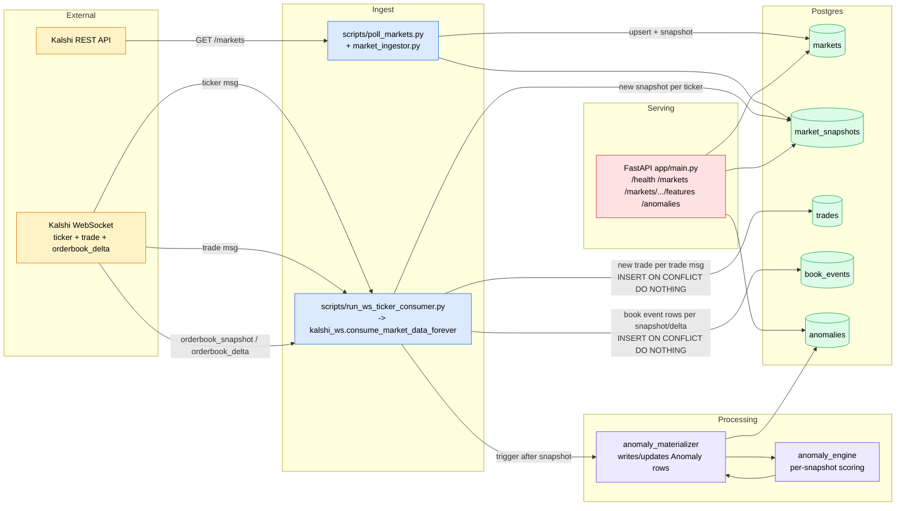

# Prediction Market Surveillance

A small market-surveillance backend for prediction markets (currently Kalshi). It ingests live market data over WebSocket and REST, persists it in Postgres, and runs detectors that flag potentially suspicious market activity. The project is being built deliberately — each addition is justified by the surveillance question it unlocks rather than by chasing scale for its own sake.

---

## 1. Overview

### What we are trying to achieve

Build a system that can identify **suspicious trading patterns** on a public prediction market with the constraints of public-only data (no counterparty / account identifiers). Specifically, the project targets a small, named taxonomy of patterns rather than one vague "anomaly score":

| # | Pattern | Detectable from public data? |
|---|---|---|
| 1 | Informed / leakage trading (price moves before public news, in the eventual winning direction) | Yes — needs trade tape + market resolution outcomes |
| 2 | Marking the close / settlement (small trades nudging price near resolution in thin liquidity) | Yes |
| 3 | Spoofing / layering (large orders added then quickly canceled) | Yes — needs order-book deltas |
| 4 | Wash trading (self-trades inflating volume) | Only suggestive signatures; full detection requires account IDs we do not have |
| 5 | Momentum ignition (deliberate burst of aggressive trades to start a move) | Yes |
| 6 | Cross-market manipulation (trades on market A move correlated market B) | Yes — needs related-market mapping |
| 7 | Quote stuffing (abnormal rate of order updates / cancellations) | Yes — needs order-book deltas |

### How we are approaching it

1. **Each pattern is a falsifiable hypothesis.** Rules are stated as testable predicates ("within N seconds of resolution, |Δprice| ≥ k σ of this market's recent return distribution and sign matches outcome"), not arbitrary thresholds.
2. **Per-market baselines, not global thresholds.** A 0.05 move is huge in a deep market and noise in a thin one — signals are scored against rolling per-market distributions (z-scores / percentile ranks) rather than fixed numbers.
3. **Resolution as ground truth.** Resolved markets give a free retrospective label for the leakage detector specifically. That is the one detector class where precision/recall can be measured cleanly.
4. **Replayable detectors.** Raw events (snapshots, trades, eventually order-book deltas) are persisted append-only so any detector can be re-run deterministically over history when its rule changes.
5. **Statistical sanity.** Permutation / bootstrap baselines and negative-control markets are used to confirm that detectors are finding real structure rather than noise.

This README is updated whenever the code changes.

---

## 2. System Architecture

### Component diagram



### How the pieces interact

- **REST poller** (`scripts/poll_markets.py` → `app/services/market_ingestor.py`) periodically pulls `/markets` from Kalshi and upserts into `markets`, writing one `market_snapshots` row per market per poll. Used to keep the universe of markets and their metadata fresh.
- **WebSocket consumer** (`scripts/run_ws_ticker_consumer.py` → `app/services/kalshi_ws.consume_market_data_forever`) holds a single authenticated WS connection to Kalshi and subscribes to `ticker` and `trade`. On each `ticker`, it appends a `market_snapshots` row and re-runs the anomaly engine for that market. On each `trade`, it appends a `trades` row.
- **Anomaly engine** (`app/services/anomaly_engine.py`) is currently a per-snapshot rule scorer (wide spread, zero liquidity, empty book, sharp price move, volume jump). It returns a `score`, `severity`, list of `reasons`, and a JSON `signals` blob.
- **Materializer** (`app/services/anomaly_materializer.py`) calls the engine for a given market over its recent snapshots and either inserts a new `anomalies` row or updates the existing one keyed on `(market_pk, latest_snapshot_id)`.
- **FastAPI** (`app/main.py` plus `app/api/routes/*`) exposes read APIs over the stored data: `health`, `markets` (list/get + snapshot history), `markets/{id}/features` (computed view of latest state), and `anomalies`.
- **Auth** (`app/services/kalshi_auth.py`) signs Kalshi requests with RSA-PSS over `{timestamp}{method}{path}` and emits the three `KALSHI-ACCESS-*` headers required by both REST and WS.

### Storage model

- **`markets`** — one row per market, keyed externally by `market_id` (Kalshi ticker). Owns `event_id`, status, open/close times.
- **`market_snapshots`** — append-only time series of L1 quote + aggregates for a market (`yes/no bid/ask`, `last_price`, `volume_fp`, `volume_24h_fp`, `open_interest_fp`, `liquidity_dollars`).
- **`trades`** — append-only public-trade tape (`trade_id` unique, `taker_side`, `count_fp`, `yes_price_dollars`, `no_price_dollars`, event-time `ts`, ingest-time `received_at`).
- **`anomalies`** — materialized output of the anomaly engine per `(market, latest_snapshot_id)` with `score`, `severity`, `reasons`, JSON `signals`.

### Tooling

- **Postgres** via SQLAlchemy 2 (`psycopg` driver) with **Alembic** migrations.
- **FastAPI / Uvicorn** for the API.
- **websockets** + **cryptography** for Kalshi WS auth and feed.
- **pytest**, **ruff**, **mypy** for tests and linting.
- **Redis** is configured in `app/core/config.py` (`redis_host`, `redis_port`) and a URL helper exists, but it is **not yet wired into any code path**. It is reserved for the queue / worker layer planned later.

---

## 3. Design decisions and changelog

This section tracks the architectural decisions actually present in the code, plus a chronological log of meaningful changes. It is updated whenever the code is updated.

### Current design choices

- **Public data only, named-pattern surveillance.** No account-level data is available from Kalshi's public feed. The detector taxonomy in §1 was chosen so each pattern is either fully detectable from public data or explicitly scoped out (wash trading).
- **Append-only event tables.** `market_snapshots` and `trades` are append-only so detectors can be replayed deterministically against historical data when rules change.
- **Event time vs ingest time are stored separately.** `trades.ts` is the Kalshi `ts_ms` (the moment the trade executed); `trades.received_at` is when the row was inserted. Surveillance queries are event-time queries; `received_at` exists for clock-skew / pipeline-latency monitoring.
- **`Numeric`, not `float`, for prices and volumes.** Money- and contract-quantity-like fields are stored at exchange precision (`Numeric(12, 4)` for dollar prices, `Numeric(18, 2)` for `*_fp` quantities) to avoid binary-floating-point error.
- **Idempotent trade ingest via `INSERT … ON CONFLICT (trade_id) DO NOTHING`.** Reconnects can replay messages; this makes ingest naturally idempotent without try/except churn or transaction poisoning.
- **One WebSocket connection, multiple channels.** `consume_market_data_forever` opens one authenticated WS and subscribes to `["ticker", "trade"]` together rather than running a connection per channel — fewer auth handshakes, fewer heartbeats, fewer sockets, and a trivial dispatcher in the message loop.
- **Composite index `(market_pk, ts)` on every event table.** The dominant detector query is *"give me events for market M between t1 and t2"*; this index turns it into a clean range scan.
- **Unique external IDs as constraints.** `markets.market_id` and `trades.trade_id` are both indexed `UNIQUE`. Dedup is enforced by the database, not application logic.
- **Snapshot-based anomaly engine, scoped to evolve.** `anomaly_engine.analyze_market` currently uses static thresholds (spread > 0.10, |Δprice| ≥ 0.15, Δvolume ≥ 25). This is acknowledged as a placeholder; the planned next step is per-market rolling baselines (z-scores / percentile ranks) and pattern-specific detectors instead of a single summed score.
- **Redis is declared but not used.** It is reserved for the planned queue / worker layer that will sit between WS ingest and the anomaly path. Wiring it in too early would be premature.
- **Backoff / reconnect on WS failures.** `consume_market_data_forever` reconnects with exponential backoff capped at 30s, so a transient Kalshi or network blip doesn't kill the consumer.

### Recent changes

Most recent first.

#### 2026-04-25 — Add public trade tape ingestion

- Added `Trade` model in `app/db/models.py`: `trade_id` unique, event-time `ts` indexed, composite `(market_pk, ts)` index for replay queries, `received_at` server-default for ingest time.
- New Alembic migration `b3a7e4c19f02_create_trades_table.py` creates the `trades` table and its indexes; `down_revision = da2173380c55` (current head).
- New `handle_trade_message` in `app/services/kalshi_ws.py` uses Postgres `INSERT … ON CONFLICT (trade_id) DO NOTHING` so reconnect-replays are idempotent and cheap.
- Renamed `consume_ticker_forever` → `consume_market_data_forever` and changed the subscribe payload from `["ticker"]` to `["ticker", "trade"]`. The message loop dispatches on `msg_type`.
- Updated `scripts/run_ws_ticker_consumer.py` to call the renamed entry point.
- Trades do **not** trigger the snapshot-based anomaly engine; coupling was deferred until the engine moves to trade-driven, baseline-aware detectors.

#### Pre-existing baseline (before this README)

- FastAPI app with routers `health`, `markets`, `markets/{id}/features`, `anomalies`.
- SQLAlchemy 2 declarative models for `Market`, `MarketSnapshot`, `Anomaly` with Alembic migrations.
- Kalshi REST client and WebSocket consumer (ticker channel only) with RSA-PSS request signing.
- Snapshot-based anomaly engine and materializer that writes to the `anomalies` table on each new snapshot.
- Bootstrap / poll / materialize / WS-consumer scripts under `scripts/`.

---

## Running locally

Prerequisites: Python 3.11+, a Postgres instance, and Kalshi API credentials (`KALSHI_API_KEY_ID`, `KALSHI_PRIVATE_KEY_PATH`).

```bash
python -m venv .venv
.venv/Scripts/pip install -r requirements.txt   # Windows; use .venv/bin/pip on *nix

# Configure .env (postgres_*, redis_*, kalshi_* — see app/core/config.py)
.venv/Scripts/python -m alembic upgrade head

# Serve the API
.venv/Scripts/python -m uvicorn app.main:app --reload

# Run the WS consumer (ticker + trade)
.venv/Scripts/python scripts/run_ws_ticker_consumer.py

# Periodic REST poll
.venv/Scripts/python scripts/poll_markets.py

# Materialize anomalies over recent snapshots
.venv/Scripts/python scripts/materialize_anomalies.py
```
