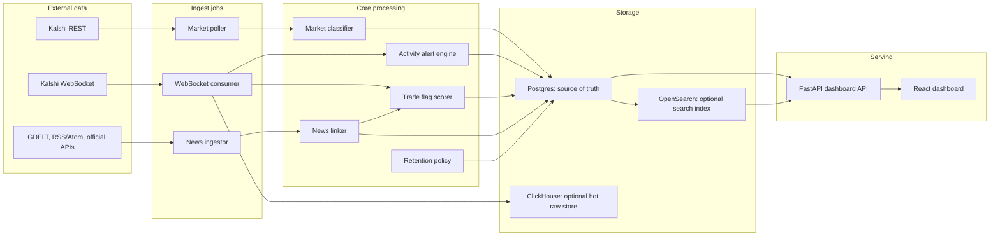
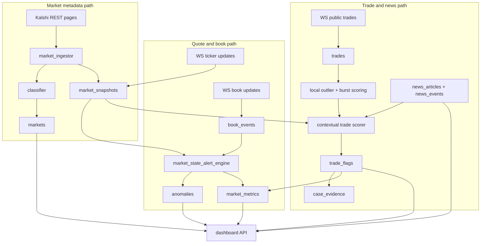
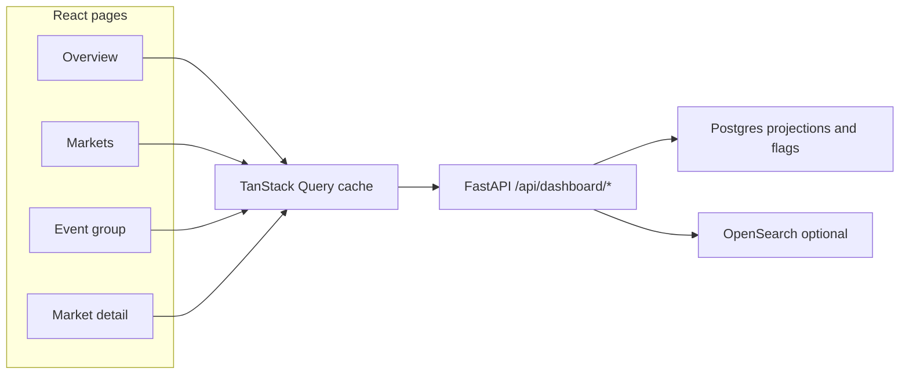

# Prediction Market Surveillance

A public-data surveillance system for Kalshi markets. It ingests market metadata,
quotes, public trades, order-book updates, and news. It then builds compact
evidence rows that help a reviewer answer:

- Which markets are worth watching?
- Which markets have unusual activity?
- Did the activity happen near relevant public news?
- Can we explain the flag without reading millions of raw events?

The system does **not** know who traded. Kalshi's public feeds do not include
account ids, so this project does not prove intent, collusion, wash trading, or
illegal conduct. It highlights patterns that deserve review.

## Plain-English Terms

| Term | Meaning |
| --- | --- |
| **Market contract** | One tradable Kalshi ticker. One event can contain many contracts. |
| **Event group** | Contracts with the same Kalshi `event_ticker`, grouped for comparison. |
| **Active/open market** | A market still live enough to monitor. Resolved sports/event markets are aged out even if stale exchange metadata says they are active. |
| **Watch priority** | A classifier bucket for how sensitive the market type is. It is not evidence by itself. |
| **Snapshot** | A saved quote update: bid/ask, last price, volume, open interest, and liquidity when available. |
| **Trade print** | One public trade: price, contract count, side, event time, and ingest time. |
| **Estimated dollars** | `contracts * side price`. This is approximate money paid for that print, not profit or account exposure. |
| **Market activity alert** | A saved quote, volume, spread, or order-book alert in `anomalies`. |
| **Local trade outlier** | A score for one trade compared with nearby trades in the same market. |
| **Trade flag** | A durable row in `trade_flags` that combines a local trade outlier with context such as liquidity, follow-through, peer baselines, and news timing. |
| **News-linked signal** | A market/news link that passed relevance and timing checks. It suggests review context, not causality. |
| **News-linked trade flag** | A market that has both a current trade flag and retained related news. |
| **Retention** | The policy that keeps useful evidence and drops low-value raw noise before storage grows out of control. |

## System Overview



The main idea is simple:

1. **Collect public data** from Kalshi and public news sources.
2. **Normalize it** into Postgres tables.
3. **Classify markets** so the system knows which topics deserve more attention.
4. **Score activity** using explainable rules, not a trained black-box model.
5. **Keep compact evidence** instead of storing every raw tick forever.
6. **Serve review screens** through a React dashboard and FastAPI API.

Postgres is the source of truth. ClickHouse and OpenSearch are optional helpers:
ClickHouse can hold short-lived high-volume raw events, and OpenSearch can speed
up search. The dashboard must still work when both are off.

## Processing Paths

The system has three main paths. They share the same Postgres market ids and
timestamps so a reviewer can line up price moves, trades, book behavior, and
news in one market detail view.



Each path can run independently. For example, if news ingest is down, quote
alerts and trade flags still work from market data. If OpenSearch is off, search
falls back to Postgres. If ClickHouse is off, Postgres still stores the core
records needed by the dashboard.

## How Data Moves Through The System

### 1. Market Metadata

The REST poller fetches Kalshi markets and writes one row per market to
`markets`. Each market is also classified into:

- `category`, such as macro, corporate, sports, judicial, crypto, weather
- `subcategory`, such as Fed decision, FDA, fight winner, player prop
- `manipulability_prior`, shown in the UI as watch priority
- classifier audit fields: layer, rule, confidence, and version

The classifier is layered:

1. Kalshi taxonomy and tags
2. Ticker prefix rules
3. Small local text matcher over seed examples
4. Optional LLM fallback, disabled by default

The priority map lives in `app/services/classifier/priorities.py`. It is the
human judgment table. The classifiers themselves are mechanical mappings.

Why this exists: not every market deserves the same review effort. A Supreme
Court ruling, an FDA decision, and a celebrity TV rating market have very
different information risks. The classifier lets the rest of the system use that
context without hard-coding one-off rules for every ticker.

### 2. Live Market Data

The WebSocket consumer listens for:

- ticker updates
- public trades
- selected order-book updates

It writes compact projections to Postgres and can also write retained raw events
to ClickHouse. Unknown market tickers are lazily inserted as stubs so live data
is not dropped just because metadata has not arrived yet. A later REST hydration
job fills in human-readable titles and classifier fields.

The WebSocket path is intentionally defensive:

- duplicate trades are ignored by a database uniqueness rule
- book events are stamped with session and sequence data
- workers read from a bounded queue so a spike does not create unlimited memory
  growth
- high-volume raw storage can be narrowed by retention settings

### 3. Market Activity Alerts

The market activity alert engine watches quote and book behavior:

- sudden price changes
- unusually wide spreads
- volume jumps
- high book update rates
- sustained cancel/pull behavior

These rows are stored in `anomalies`. The name is historical; in the UI these
are called **Market activity alerts** or **Alert history**. They are about the
state of the market, not about a specific trade.

Continuing alerts are compacted. A row is updated instead of inserting a new
near-duplicate every few seconds. New rows are kept for first alert, severity
upgrade, or a cooldown sample.

This keeps the UI readable. A market with a wide spread for ten minutes should
not create hundreds of identical rows. It should create a small trail that says
when the alert started, how it changed, and why it mattered.

### 4. Trade Flags

Trade flags are about individual public trades. The scorer asks:

- Was this trade large for this market?
- Was it large compared with similar markets?
- Did price move after the trade?
- Did the move persist or quickly reverse?
- Did related markets move too?
- Was there relevant news before or after the trade?
- Is this a market type where early information could matter?

Tiny one-off trades are discounted unless they are part of a fast same-side
cluster. Public news seen before a trade discounts the score, because a move
after public news is less surprising than a move before news.

Durable flags are written to `trade_flags`. High-value flags can promote the
market's storage tier and create a `case_evidence` window for later review.

Trade flags are separate from market activity alerts:

- a **market activity alert** says the market state looked unusual
- a **trade flag** says one public trade looked unusual after context was added
- a **news-linked trade flag** says a market has a current trade flag and
  retained related news

That separation keeps the UI from implying that every quote alert is a suspicious
trade, or that every trade outlier is meaningful without context.

### 5. News Linking

The news pipeline pulls from GDELT, RSS/Atom feeds, and official APIs such as
Federal Register, SEC EDGAR current 8-K filings, and FDA MedWatch alerts.

News is handled in four steps:

1. Normalize and URL-dedupe articles into `news_articles`.
2. Generate candidate markets using market profiles.
3. Score article/market relevance and likely YES/NO direction.
4. Apply a category-aware gate before saving a `news_events` link.

The category gate exists to avoid noisy links. Broad business headlines should
not attach to a narrow company-specific market unless the article names a direct
anchor. Broad factor news is allowed for categories where that makes sense,
such as macro, crypto, and official weather.

If GDELT is slow or unavailable, the rest of the system continues. The trade
scorer simply has less news context until the next successful ingest.

The news path is deliberately global-first. Instead of searching only when a
user opens one market page, the background pipeline stores reusable article
metadata and market links. Market detail pages can still do search-backed
fallbacks, but the main dashboard should be able to explain signals from stored
data.

### 6. Retention And Storage Control

This project is a surveillance dashboard, not a permanent raw-data lake. The
valuable artifact is a small, explainable evidence trail:

- market metadata
- latest serving projections
- market activity alerts
- trade flags
- relevant news links
- promoted case windows

Low-value raw events are pruned or compacted. This keeps a budget deployment
small enough to run on one EC2 instance.

Retention has two jobs:

1. Keep enough detail to explain a flag.
2. Stop raw quote/book/trade tables from turning the project into a storage bill.

When a market has stronger evidence, its retention tier can rise. That lets the
system keep more context around the markets that matter while being aggressive
about low-value background noise.

## Storage Model

| Table | Purpose |
| --- | --- |
| `markets` | One row per Kalshi ticker, including status, event id, title, timing, and classifier output. |
| `market_snapshots` | Quote and market-state updates over time. |
| `trades` | Public trade tape: trade id, side, count, prices, event time, ingest time. |
| `book_events` | Selected order-book snapshots and deltas. |
| `anomalies` | Saved market activity alerts. |
| `market_metrics` | Compact read model for lists, counters, latest quote hints, retention tier, and dashboard scores. |
| `trade_baselines` | Peer baselines by category/subcategory. |
| `trade_flags` | Durable trade-level review candidates with scores, reasons, and components. |
| `news_articles` | Deduped article metadata. |
| `market_news_profiles` | Market keywords and anchors used for candidate news matching. |
| `news_events` | Saved article-to-market links and pre-news trade scores. |
| `case_evidence` | Promoted evidence windows around important flags. |

Optional stores:

- **ClickHouse**: short-lived high-volume raw trades, quote changes, and book
  events. Controlled by `KALSHI_RAW_BACKEND`.
- **OpenSearch**: fuzzy market/news search. Rebuildable from Postgres.

## Code Map

| Area | Main files |
| --- | --- |
| App composition | `app/main.py`, `app/core/config.py`, `app/core/rate_limit.py` |
| Database | `app/db/models.py`, `app/db/session.py`, `alembic/versions/*` |
| Dashboard API | `app/api/routes/dashboard.py` |
| Kalshi REST/WS | `app/services/kalshi_rest.py`, `app/services/kalshi_ws.py`, `app/services/kalshi_auth.py` |
| Market lifecycle | `app/services/market_lifecycle.py`, `app/services/market_ingestor.py` |
| Classification | `app/services/classifier/*` |
| Activity alerts | `app/services/market_state_alert_engine.py`, `app/services/anomaly_materializer.py`, `app/services/book_activity_signals.py` |
| Trade scoring | `app/services/trade_suspicion.py`, `app/services/trade_burst.py`, `app/services/trade_context.py`, `app/services/trade_flag_materializer.py`, `app/services/trade_baselines.py` |
| News | `app/services/news_ingestor.py`, `app/services/news_sources.py`, `app/services/news_link_scoring.py`, `app/services/news_category_gate.py`, `app/services/news_trade_correlation.py` |
| Search | `app/services/search_index.py`, `scripts/rebuild_search_index.py` |
| Retention and storage | `app/services/retention.py`, `app/services/storage_health.py`, `scripts/run_retention_maintenance.py` |
| Frontend | `frontend/src/routes/*`, `frontend/src/components/*`, `frontend/src/api/*` |

## Dashboard And API



Important API surfaces:

- `GET /api/dashboard/overview` bundles the home page payload into one request.
- `GET /api/dashboard/markets` lists active or historical markets with filters.
- `GET /api/dashboard/markets/{market_id}` returns detail data.
- `GET /api/dashboard/markets/{market_id}/series` returns chart data and recent
  trade inspection scores.
- `GET /api/dashboard/markets/{market_id}/news` returns stored and search-backed
  related news.
- `GET /api/dashboard/search` searches markets and stored news.
- `GET /api/dashboard/pipeline-health` shows freshness and counts for jobs.
- `GET /api/dashboard/storage-health` reports disk and table pressure.

The frontend uses URL search params on `/markets` so filtered views can be
shared. The event page groups related contracts by Kalshi `event_ticker`.

The market detail chart clamps probability-like prices to `[0, 1]` both in the
API payload and before rendering. Chart arrows are reserved for stronger saved
market activity alerts, so low-level alert history does not crowd the chart.

Dashboard pages:

| Page | Purpose |
| --- | --- |
| **Overview** | High-level counts, active leaderboards, pipeline health, news diagnostics, top trade flags, and recent market activity alerts. |
| **Markets** | Filterable market table with priority, evidence scores, trade counts, alert counts, and sort modes. |
| **Event group** | Shows all contracts in one Kalshi event, useful for comparing related outcomes. |
| **Market detail** | Price chart, recent trades, local outlier scores, alert history, related news, and classifier metadata. |

The list sort names are intentionally plain in the UI:

- **News-linked trade flags**: markets with a current trade flag and retained
  related news, ranked by top flag score
- **Highest trade flag**: all markets with durable trade flags, ranked by top
  score
- **Activity alerts first**: markets with saved quote/book/volume alerts first
- **Watch priority, then trades**: classifier priority first, trade count second

## Active vs Historical Markets

Most dashboard views default to active markets. A market is treated as active
when it is open/active and not past `close_time`. Some sports and scheduled
event markets keep stale exchange metadata, so `app/services/market_lifecycle.py`
also reads ticker dates and event prefixes to age out resolved games, fights,
and similar contracts.

Historical markets stay queryable for post-mortem review. They do not mix into
the live monitoring lists unless `market_scope=historical` or `market_scope=all`
is requested.

## Priority vs Evidence

The UI intentionally separates two ideas:

- **Watch priority**: the type of market may react to early information.
- **Evidence**: this specific market has data worth reviewing.

High priority alone is not suspicious. Evidence comes from saved market activity
alerts, trade flags, local trade outlier scores, and news timing.

The highest priority bucket is intentionally narrow. It includes markets such as
Fed decision windows, judicial rulings, mergers, FDA-style corporate events,
combat-sports winners, and explicit player/first-event props. Broad macro data,
scheduled earnings, and team outcomes generally sit one level lower so the top
watchlist stays reviewable.

Scores are also separated:

- `evidence_score`: how much saved evidence exists for this market
- `urgency_score`: evidence plus priority, used for review ordering
- local trade outlier score: a market-detail inspection aid for recent trades
- trade flag score: durable contextual score written by the materializer

## Design Choices

| Choice | Why it matters | Tradeoff |
| --- | --- | --- |
| Public data only | The project can run from public Kalshi feeds and public news. | It cannot identify accounts or prove intent. |
| Explainable rules | Every flag has score components and reasons. | Less adaptive than a trained model. |
| Market-specific baselines | A trade is compared with local and peer behavior. | Requires background materializers. |
| Append-only raw events | Rules can be replayed on retained history. | Raw tables need retention controls. |
| Compact projections | The dashboard reads small serving rows first. | Backfills are needed after some scoring changes. |
| Optional hot stores | ClickHouse/OpenSearch help when available. | Postgres remains responsible for correctness. |
| Retention-first design | Budget deployments stay manageable. | Some low-value raw detail is intentionally discarded. |

## Operational Shape

The budget deployment is one small AWS instance running Docker Compose:

- Postgres
- Redis
- FastAPI + built React dashboard
- Pipeline worker
- Caddy in front for HTTPS and access logs

The production Dockerfile builds the React frontend and serves it from the same
FastAPI container. `docker-compose.budget.yml` binds the app to
`127.0.0.1:8000`; public traffic should go through Caddy on ports `80` and
`443`.

Rate limiting is enabled for `/api/*`:

```text
RATE_LIMIT_DEFAULT_PER_MINUTE=120
RATE_LIMIT_EXPENSIVE_PER_MINUTE=30
RATE_LIMIT_HEALTH_PER_MINUTE=600
```

Static frontend assets are not app-rate-limited. Search and news endpoints use
the lower "expensive" bucket.

Detailed deployment notes live in `docs/deployment.md`.

## Runtime Configuration

Most configuration comes from `.env` through `app/core/config.py`.

| Setting | What it controls |
| --- | --- |
| `POSTGRES_*` | Main Postgres connection. |
| `REDIS_HOST`, `REDIS_PORT` | Dashboard cache and API rate limiter. |
| `KALSHI_API_KEY_ID`, `KALSHI_PRIVATE_KEY_PEM` | Kalshi API authentication. |
| `KALSHI_RAW_BACKEND` | Raw event target: `postgres`, `clickhouse`, or `dual`. |
| `KALSHI_BOOK_MARKET_LIMIT` | How many markets get order-book subscriptions by default. |
| `KALSHI_WS_WORKER_COUNT` | Number of worker tasks draining the WebSocket queue. |
| `RETENTION_*` | Raw event age limits and pruning batch size. |
| `OPENSEARCH_URL` | Optional OpenSearch endpoint. Empty means Postgres fallback. |
| `CLICKHOUSE_URL` | Optional ClickHouse endpoint. |
| `RATE_LIMIT_*` | API request caps by route type. |

Budget defaults favor low storage growth:

```text
KALSHI_RAW_BACKEND=postgres
KALSHI_BOOK_MARKET_LIMIT=5
KALSHI_WS_WORKER_COUNT=1
RETENTION_BOOK_EVENTS_MAX_AGE_DAYS=1
RETENTION_SNAPSHOT_OBSERVE_MAX_AGE_DAYS=1
RETENTION_SNAPSHOT_SAMPLED_MAX_AGE_DAYS=3
RETENTION_SNAPSHOT_HOT_MAX_AGE_DAYS=14
```

## Important Scripts

| Script | Use |
| --- | --- |
| `scripts.bootstrap_markets` | One-shot market universe load from Kalshi REST. |
| `scripts.poll_markets` | Periodic REST sweep and metadata refresh. |
| `scripts.run_ws_ticker_consumer` | Live ticker, trade, and selected book ingest. |
| `scripts.hydrate_unknown_markets` | Fill titles/status/classification for WS-discovered stubs. |
| `scripts.classify_markets` | Reclassify rows after classifier version changes. |
| `scripts.materialize_anomalies` | Write market activity alerts from recent snapshots/book data. |
| `scripts.materialize_trade_baselines` | Build peer baselines used by trade flag scoring. |
| `scripts.materialize_trade_flags` | Write durable trade flags. |
| `scripts.ingest_news` | One-shot news ingest. |
| `scripts.run_news_surveillance_pipeline` | Main news + trade-flag + news-correlation loop. |
| `scripts.relink_stored_news_articles` | Re-score stored articles against current market profiles. |
| `scripts.revalidate_news_links` | Update or remove older links using current guardrails. |
| `scripts.rebuild_search_index` | Rebuild OpenSearch from Postgres. |
| `scripts.run_retention_maintenance` | Prune or compact raw data according to retention policy. |

## Common Failure Modes

| Symptom | Likely cause | What to check |
| --- | --- | --- |
| Dashboard loads but counts are flat | Pipeline worker is stopped or stale. | `/api/dashboard/pipeline-health`, `docker compose logs pipeline` |
| Markets show raw tickers as titles | WS discovered stubs before REST hydration. | Run `scripts.hydrate_unknown_markets --top-by-trades`. |
| News panels are empty | News source failed, links were filtered, or no relevant news exists. | `/api/dashboard/news-diagnostics`, pipeline logs. |
| Search is weak | OpenSearch is off or index is empty. | Run `scripts.rebuild_search_index`; Postgres fallback still works. |
| Disk usage grows quickly | Raw retention is too loose or book market limit is too high. | `/api/dashboard/storage-health`, retention settings. |
| Public API receives many requests | Crawler or refresh loop. | Rate-limit headers, Caddy access log. |
| `WinError 10013` on local Uvicorn | Windows reserved port range. | Run Uvicorn on another port, such as `8001`. |

## Running Locally

Prerequisites:

- Python 3.11+
- Node/npm for the frontend build
- Docker Compose
- Kalshi API credentials

Install Python dependencies:

```bash
python -m venv .venv
.venv/Scripts/pip install -r requirements.txt
```

Create `.env` from your local or budget example and set the Postgres, Redis, and
Kalshi values:

```bash
cp .env.budget.example .env
```

Start local services:

```bash
docker compose up -d postgres redis clickhouse opensearch
.venv/Scripts/python -m alembic upgrade head
```

Optional ClickHouse schema:

```powershell
Get-Content sql/clickhouse_kalshi.sql | docker compose exec -T clickhouse clickhouse-client --multiquery
```

Bootstrap markets and build the UI:

```bash
PYTHONPATH=. .venv/Scripts/python -m scripts.bootstrap_markets --status open
cd frontend && npm install && npm run build && cd ..
```

Run the API and dashboard:

```bash
.venv/Scripts/python -m uvicorn app.main:app --reload
```

Open:

```text
http://127.0.0.1:8000/
http://127.0.0.1:8000/docs
```

For frontend hot reload, run Vite separately:

```bash
cd frontend
npm run dev
```

Then open:

```text
http://127.0.0.1:5173
```

Useful local background jobs:

```bash
PYTHONPATH=. .venv/Scripts/python -m scripts.run_ws_ticker_consumer
PYTHONPATH=. .venv/Scripts/python -m scripts.poll_markets
PYTHONPATH=. .venv/Scripts/python -m scripts.hydrate_unknown_markets --top-by-trades
PYTHONPATH=. .venv/Scripts/python -m scripts.classify_markets --top-by-trades
PYTHONPATH=. .venv/Scripts/python -m scripts.run_news_surveillance_pipeline --rescore-news
PYTHONPATH=. .venv/Scripts/python -m scripts.materialize_anomalies
```

## Tests And Checks

```bash
# Unit tests
.venv/Scripts/python -m pytest tests/

# Integration tests against a real Postgres test DB
docker compose up -d postgres
docker compose exec -T postgres psql -U postgres -c "CREATE DATABASE surveillance_test"
RUN_INTEGRATION=1 .venv/Scripts/python -m pytest tests/test_migrations_integration.py -v

# Static checks
.venv/Scripts/python -m ruff check app/ tests/
.venv/Scripts/python -m mypy app/
```

## Current State

The current system includes:

- market metadata ingestion and hydration
- live public trade and quote ingest
- selected order-book ingest
- layered market classification
- market activity alerts
- local trade outlier scoring
- durable trade flags
- global news ingest and article-to-market linking
- news/trade timing correlation
- retention and storage-health guardrails
- React dashboard served by FastAPI
- optional ClickHouse and OpenSearch paths
- Redis-backed dashboard caching and API rate limiting

The most important remaining limitation is still the public-data boundary:
without account-level data, the system can find suspicious-looking public
patterns, but it cannot prove who traded or why.
