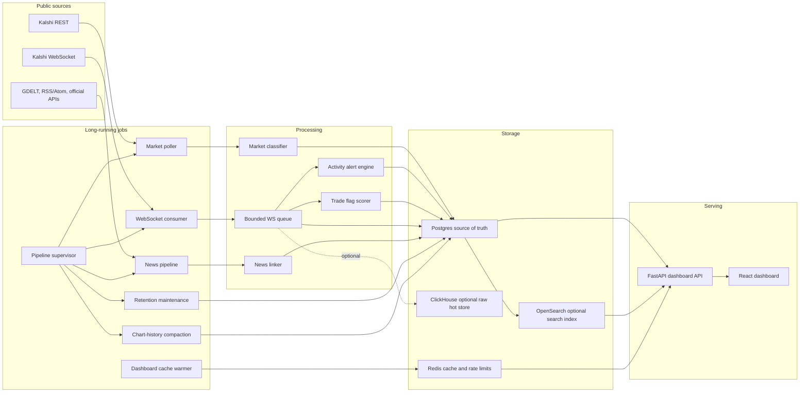
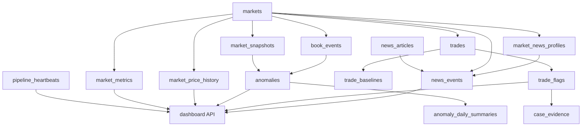
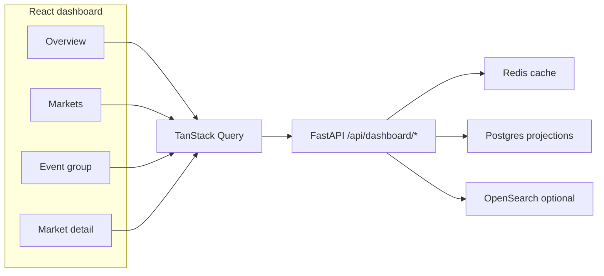

# Prediction Market Surveillance

A public-data surveillance system for Kalshi markets. It ingests market
metadata, public quotes, public trades, selected order-book updates, and public
news. It turns those streams into compact evidence rows that help a reviewer
answer:

- Which markets deserve attention?
- Which markets have unusual activity?
- Did the activity happen near relevant public news?
- Can the flag be explained without scanning millions of raw events?

The system does not know who traded. Kalshi public feeds do not include account
ids, so this project cannot prove intent, collusion, wash trading, or illegal
conduct. It highlights public patterns that deserve review.

## Terms

| Term | Meaning |
| --- | --- |
| Market contract | One tradable Kalshi ticker. One event can contain many contracts. |
| Event group | Contracts with the same Kalshi `event_ticker`, grouped for comparison. |
| Active/open market | A market still live enough to monitor. Stale sports/event markets are aged out by lifecycle rules even if exchange metadata lags. |
| Watch priority | A classifier bucket for market sensitivity. It is context, not evidence. |
| Market snapshot | A raw quote/market-state row: bid, ask, last price, volume, open interest, and liquidity when available. |
| Chart history | The compact `market_price_history` read model used by price charts. Current buckets are 5 minutes; old closed markets can be compacted to 1 hour. |
| Order-book event | A selected visible depth snapshot or delta. This is high-volume and short-retention by default. |
| Trade print | One public trade: price, contract count, side, event time, and ingest time. |
| Estimated dollars | `contracts * side price`. It approximates money paid for that print, not profit or account exposure. |
| Market activity alert | A saved quote, spread, volume, or book-behavior alert in `anomalies`. |
| Trade flag | A durable row in `trade_flags` combining local trade outlier behavior with liquidity, follow-through, peer baselines, and news timing. |
| News-linked signal | A market/news link that passed relevance and timing gates. It suggests review context, not causality. |
| Projection/read model | A compact serving table such as `market_metrics` or `market_price_history`, built so the dashboard avoids raw-table scans. |
| Retention | Policies that preserve useful evidence and prune or compact low-value raw noise. |

## Architecture



Postgres is the source of truth. ClickHouse and OpenSearch are optional
accelerators. The dashboard must still work when both are off.

## Data Paths

### Market Metadata

The REST poller fetches Kalshi markets and writes one row per contract to
`markets`. It also classifies each market into:

- `category`, such as macro, corporate, judicial, sports, crypto, or weather
- `subcategory`, such as Fed decision, FDA, fight winner, or player prop
- `manipulability_prior`, displayed as watch priority
- classifier audit fields: layer, rule, confidence, and version

The classifier is layered: Kalshi taxonomy and tags, ticker-prefix rules, local
text matching, and an optional LLM fallback that is disabled by default.

Why this exists: a Supreme Court ruling, an FDA decision, and a player prop do
not deserve the same review budget. Priority lets the system allocate attention
without hard-coding one-off rules throughout the pipeline.

### Live Market Data

The WebSocket consumer listens for ticker updates, public trades, and selected
order-book updates.

Important resource controls:

- A bounded asyncio queue prevents unbounded memory growth during spikes.
- `KALSHI_WS_WORKER_COUNT` controls database writer concurrency. Budget default
  is one worker to avoid lock contention on compact projection rows.
- Ticker writes are coalesced and batched so a burst becomes fewer database
  round-trips.
- Known-market gating limits writes to active/open/in-scope tickers and skips
  categories/priorities that are intentionally out of scope.
- Unknown WS tickers can be inserted as stubs, then hydrated by later REST
  sweeps.
- Duplicate trades are rejected by a database uniqueness rule.
- Postgres deadlocks on hot projection upserts are retried once in the worker.

Budget deployments collect chart history from ticker and trade messages. They
also keep raw ticker snapshots enabled, but gated by retention tier so the
system keeps evidence without storing every quote tick:

```text
KALSHI_CHART_HISTORY_ENABLED=1
KALSHI_WS_TICKER_SNAPSHOTS_ENABLED=1
KALSHI_POLLER_QUOTE_SNAPSHOTS_ENABLED=0
```

Raw snapshots remain useful as fallback evidence for alerts, trade context, and
pre-chart-history gaps. The long-term chart source is still
`market_price_history`, and snapshot retention is guarded by chart-history
coverage plus latest-snapshot/anomaly references.

### Chart History

`market_price_history` is the durable chart read model. It stores OHLC-style
price buckets plus close bid/ask, volume, open interest, and source counts.
Current live buckets default to 5 minutes; scheduled compaction can roll old
closed markets to hourly and, later, daily buckets without a new table.

Chart reads use a hybrid path:

1. Read 5-minute chart-history buckets first.
2. If needed, read compacted chart-history intervals such as 1-hour buckets.
3. Fall back to raw `market_snapshots` only for periods not covered by chart
   history, such as pre-collection history or internal gaps.

That means charts can move to the compacted table without losing older data
that was only available as raw snapshots.

### Activity Alerts

Market activity alerts are stored in `anomalies`. They cover market-state
behavior, not account-level behavior:

- sudden price changes
- unusually wide spreads
- volume jumps
- high book update rates
- sustained cancel/pull behavior

Continuing alerts are compacted in place. The materializer inserts a new row for
first alert, severity upgrade, or cooldown sample; otherwise it updates the
existing alert. This keeps the UI readable and avoids hundreds of near-duplicate
rows during a sustained condition.

### Trade Flags

Trade flags are about individual public prints. The scorer asks:

- Was this trade large for the market?
- Was it large compared with similar markets?
- Did price move after the trade?
- Did the move persist or revert?
- Did related contracts move too?
- Was relevant public news already available?
- Is this market type sensitive to early information?

Durable flags are written to `trade_flags`. Higher-value flags can promote the
market storage tier and create a `case_evidence` window for later review.
Before raw trade retention removes old tape, flagged prints are copied to
`trade_evidence`, which is independent of the raw `trades` row lifetime.

### News Linking

The news pipeline pulls from GDELT, RSS/Atom feeds, and official APIs such as
Federal Register, SEC EDGAR current 8-K filings, and FDA MedWatch alerts.

The path is global-first:

1. Normalize and URL-dedupe articles into `news_articles`.
2. Build market candidates from `market_news_profiles`.
3. Score relevance and likely YES/NO direction.
4. Apply category-aware gates before saving `news_events`.

If news ingest is unavailable, quote alerts and trade flags still work. The
scorer simply has less public-news context until the next successful ingest.

### Retention And Compaction

This project is not a permanent raw-data lake. The valuable artifact is a small,
explainable evidence trail:

- market metadata
- chart history
- latest serving projections
- market activity alerts
- durable trade flags
- historical trade/anomaly evidence highlights
- relevant news links
- promoted case windows

Retention prunes bulky raw tables. Chart-history compaction can run a policy
list such as `300:3600:7,3600:86400:180`, meaning 5-minute rows compact to
hourly after 7 days closed, and hourly rows compact to daily after 180 days
closed:

```text
python -m scripts.run_chart_history_compaction --watch --execute --replace-source-rows --policies 300:3600:7,3600:86400:180
```

The compaction job:

- selects closed/resolved markets whose source buckets are older than the grace
  period
- writes target buckets with the requested interval
- deletes source rows only when `--replace-source-rows` is set
- writes pipeline heartbeats
- uses a Postgres advisory lock so overlapping schedules do not compact the same
  market at the same time

Raw trade retention is tier-aware and closed-market-only by default. It requires
matching chart-history coverage and preserves flagged raw trades unless
`--delete-flagged-trades-with-evidence` is explicitly set. The budget profile
keeps a 1-day observe window, 14-day sampled window, 30-day hot window, 90-day
triggered window, and 365-day case window after close.

Anomaly retention summarizes low-signal rows into `anomaly_daily_summaries`.
Rows above the evidence threshold, or any medium/high/critical rows included by
an operator, are materialized into `anomaly_evidence` before deletion.

The budget compose profile runs chart compaction every 6 hours with
`max_markets=250`.

## Storage Schema



| Table | Purpose |
| --- | --- |
| `markets` | One row per Kalshi ticker, including status, timing, event id, title, and classifier output. |
| `market_metrics` | Compact market projection for lists, latest price hints, retention tier, alert counts, trade counts, and scores. |
| `market_price_history` | Bucketed chart history. Live 5-minute rows can be compacted to hourly or daily rows after close. |
| `market_snapshots` | Raw quote/market-state evidence rows. Optional for WS ticker updates in budget mode. |
| `trades` | Public trade tape with uniqueness on exchange trade id. |
| `trade_flags` | Recent trade-level review candidates with scores, reasons, and components. |
| `trade_evidence` | Durable suspicious-trade highlights copied before raw trade pruning. |
| `trade_baselines` | Peer baselines by category/subcategory. |
| `book_events` | Selected order-book snapshots and deltas. Highest growth raw table. |
| `anomalies` | Saved market activity alerts. |
| `anomaly_daily_summaries` | Compacted low-signal alert summaries. |
| `anomaly_evidence` | Durable anomaly highlights copied before raw anomaly pruning. |
| `market_features_1m` | Derived per-minute market features for scoring/research paths. |
| `news_articles` | Deduped article metadata. |
| `market_news_profiles` | Market-specific anchors and keywords for news matching. |
| `news_events` | Saved article-to-market links and timing features. |
| `case_evidence` | Promoted evidence windows around important flags. |
| `pipeline_heartbeats` | Durable status, count, and metadata for background jobs. |

Optional stores:

- ClickHouse: short-lived high-volume raw events when `KALSHI_RAW_BACKEND` is
  `clickhouse` or `dual`.
- OpenSearch: fuzzy market/news search. Rebuildable from Postgres.
- Redis: dashboard response cache and API rate-limit counters.

## Dashboard API



Important endpoints:

| Endpoint | Use |
| --- | --- |
| `GET /api/dashboard/overview` | First-paint bundle: stats, top markets, alerts, flags, and news signals. |
| `GET /api/dashboard/markets` | Filterable market table with cheap pagination by default. |
| `GET /api/dashboard/markets/{market_id}` | Market detail payload. |
| `GET /api/dashboard/markets/{market_id}/series` | Trades and chart points. Uses chart history first, raw snapshots as fallback. |
| `GET /api/dashboard/markets/{market_id}/news` | Stored and search-backed related news. |
| `GET /api/dashboard/search` | Market and news search. |
| `GET /api/dashboard/pipeline-health` | Job freshness from `pipeline_heartbeats`. |
| `GET /api/dashboard/storage-health` | Disk and table-pressure snapshot. |

The frontend uses URL search params on `/markets` so filtered views can be
shared. Market detail charts clamp probability-like values to `[0, 1]`, show
selected alert/outlier markers, and do not need to know whether a point came
from a live bucket, compacted bucket, or raw fallback snapshot.

## Operational Design Tradeoffs

| Choice | Why it matters | Tradeoff |
| --- | --- | --- |
| Public data only | Anyone can run the system from public Kalshi/news data. | It cannot identify accounts or prove intent. |
| Postgres source of truth | Simpler budget deployment and transactional correctness for projections. | Requires retention and careful indexes as raw tables grow. |
| Compact chart history | Charts no longer depend on keeping every raw quote snapshot. | Needs backfill/compaction jobs and fallback logic for old gaps. |
| Bounded WS queue | Protects memory during market-data bursts. | If downstream writes are too slow, the system must shed or coalesce work. |
| Coalesced ticker writes | Reduces CPU and lock pressure during quote storms. | Intermediate quote ticks are summarized into buckets/projections. |
| Low worker count by default | Avoids Postgres deadlocks on hot upserts in small deployments. | Higher-throughput deployments may tune worker count upward. |
| Exponential supervisor backoff | Failed child jobs restart without tight crash loops. | A repeatedly failing job may lag until fixed. |
| Advisory locks for maintenance | Scheduled maintenance can overlap safely. | A stuck DB session can delay the next sweep until the connection is gone. |
| Explainable scoring | Every flag has reasons and components. | Less adaptive than a trained black-box model. |
| Optional ClickHouse/OpenSearch | Adds scale paths without making them correctness dependencies. | More moving parts when enabled. |

## Changelog

### 2026-06-22

- Added runtime archive mode (`ARCHIVE_MODE`, `DATA_CUTOFF_AT`) for serving
  frozen historical charts, trades, stored news, and findings while ingestion
  is paused. The UI shows a persistent cutoff banner, suppresses live pipeline
  status, and avoids live GDELT fallback requests.
- Changed the budget Redis eviction policy to `allkeys-lfu` so frequently used
  dashboard payloads are favored during long-lived archive operation.

### 2026-05-11

- Raw retention batching (`scripts/run_retention_maintenance.py`, `scripts/run_pipeline.py`, `app/core/config.py`, `docker-compose.budget.yml`): removed the fixed sleep between delete batches (`sleep_seconds` default `0`); default **`retention_batch_size` is 2500** and **`max_batches` is 60** (same cap per sweep as before: 60×2500 = 20×5000 rows per tier when batches are full). Env override remains `KALSHI_RETENTION_MAX_BATCHES`. Snapshot sweeps still use `stop_on_partial_batch=False` so a short batch does **not** end the tier early (partial batches are normal given the per-market lateral cap).
- Dashboard Redis cache (`_cached_dashboard_payload` in `app/api/routes/dashboard.py`):
  normal API reads no longer call `EXPIRE` on hits, so user traffic cannot keep
  stale JSON alive past the original `SETEX` TTL. `warm_dashboard_cache_once`
  always passes `force_refresh=True` so the pipeline’s cache warmer still
  recomputes every warmed key and applies a fresh TTL each cycle.
- Unit tests in `tests/test_dashboard_helpers.py` cover Redis hit (no rebuild)
  vs `force_refresh` (rebuild without `GET`).

## Runtime Configuration

Most configuration comes from `.env` through `app/core/config.py`.

| Setting | What it controls |
| --- | --- |
| `POSTGRES_*` | Main Postgres connection. |
| `REDIS_HOST`, `REDIS_PORT` | Dashboard cache and API rate limiter. |
| `ARCHIVE_MODE`, `DATA_CUTOFF_AT` | Serve the site as a frozen historical archive and disclose the UTC ingestion cutoff. |
| `KALSHI_API_KEY_ID`, `KALSHI_PRIVATE_KEY_PEM`, `KALSHI_PRIVATE_KEY_PATH` | Kalshi API authentication. |
| `KALSHI_RAW_BACKEND` | Raw event target: `postgres`, `clickhouse`, or `dual`. |
| `KALSHI_BOOK_MARKET_LIMIT` | How many markets receive order-book subscriptions. |
| `KALSHI_WS_WORKER_COUNT` | Number of worker tasks draining the WS queue. |
| `KALSHI_WS_QUEUE_SIZE` | Maximum pending WS messages before backpressure/shedding decisions matter. |
| `KALSHI_CHART_HISTORY_ENABLED` | Enables bucketed chart-history writes. |
| `KALSHI_CHART_HISTORY_INTERVAL_SEC` | Live chart bucket width, default `300`. |
| `KALSHI_WS_TICKER_SNAPSHOTS_ENABLED` | Enables raw `market_snapshots` rows from WS ticker updates. Budget default is `1`, with storage-tier sampling. |
| `KALSHI_POLLER_QUOTE_SNAPSHOTS_ENABLED` | Enables raw REST quote snapshots from the poller. Budget default is `0`. |
| `KALSHI_REST_RETRY_*` | REST retry attempts and exponential backoff base. |
| `DASHBOARD_*_CACHE_TTL_SEC` | Redis TTLs for dashboard API payloads. |
| `RETENTION_*` | Raw event age limits and pruning batch size (`retention_batch_size` default `2500` in `app/core/config.py`). |
| `KALSHI_RETENTION_MAX_BATCHES` | Caps retention delete loops per table tier (default `60` in `scripts/run_retention_maintenance.py`). |
| `OPENSEARCH_URL` | Optional OpenSearch endpoint. Empty means Postgres fallback. |
| `CLICKHOUSE_URL` | Optional ClickHouse endpoint. |
| `RATE_LIMIT_*` | API request caps by route type. |

Budget defaults favor low storage growth:

```text
KALSHI_RAW_BACKEND=postgres
KALSHI_BOOK_MARKET_LIMIT=5
KALSHI_WS_WORKER_COUNT=1
KALSHI_WS_QUEUE_SIZE=2500
KALSHI_CHART_HISTORY_ENABLED=1
KALSHI_WS_TICKER_SNAPSHOTS_ENABLED=1
RETENTION_BOOK_EVENTS_MAX_AGE_DAYS=1
RETENTION_SNAPSHOT_OBSERVE_MAX_AGE_DAYS=1
RETENTION_SNAPSHOT_SAMPLED_MAX_AGE_DAYS=3
RETENTION_SNAPSHOT_HOT_MAX_AGE_DAYS=14
```

## Important Scripts

| Script | Use |
| --- | --- |
| `scripts.run_pipeline` | Lightweight supervisor for API, poller, WS, news, retention, compaction, and cache warmer. |
| `scripts.bootstrap_markets` | One-shot market universe load from Kalshi REST. |
| `scripts.poll_markets` | Periodic REST sweep and metadata refresh. |
| `scripts.run_ws_ticker_consumer` | Live ticker, trade, and selected book ingest. |
| `scripts.hydrate_unknown_markets` | Fill titles/status/classification for WS-discovered stubs. |
| `scripts.classify_markets` | Reclassify rows after classifier changes. |
| `scripts.backfill_market_price_history` | Build chart-history buckets from retained raw trades/snapshots. |
| `scripts.run_chart_history_compaction` | Compact old closed-market chart buckets using interval policies such as 5 minutes to 1 hour and 1 hour to 1 day. |
| `scripts.materialize_anomalies` | Write market activity alerts from recent snapshots/book data. |
| `scripts.materialize_trade_baselines` | Build peer baselines used by trade flag scoring. |
| `scripts.materialize_trade_flags` | Write durable trade flags. |
| `scripts.run_news_surveillance_pipeline` | Main news, trade-flag, and news-correlation loop. |
| `scripts.relink_stored_news_articles` | Re-score stored articles against current market profiles. |
| `scripts.revalidate_news_links` | Update or remove older links using current guardrails. |
| `scripts.rebuild_search_index` | Rebuild OpenSearch from Postgres. |
| `scripts.run_retention_maintenance` | Prune bulky raw tables according to tiered retention policy, including guarded raw trade retention. |
| `scripts.run_anomaly_retention` | Compact or delete low-signal alert history while preserving qualifying evidence. |
| `scripts.warm_dashboard_cache` | Precompute dashboard first-paint payloads in Redis. |

## Running Locally

Prerequisites:

- Python 3.11+
- Node/npm for the frontend build
- Docker Compose
- Kalshi API credentials

Install Python dependencies:

```powershell
python -m venv .venv
.\.venv\Scripts\pip.exe install -r requirements.txt
```

Create `.env`:

```powershell
Copy-Item .env.budget.example .env
```

Start local services and run migrations:

```powershell
docker compose up -d postgres redis
.\.venv\Scripts\python.exe -m alembic upgrade head
```

Optional services:

```powershell
docker compose up -d clickhouse opensearch
Get-Content sql/clickhouse_kalshi.sql | docker compose exec -T clickhouse clickhouse-client --multiquery
```

Bootstrap markets and build the UI:

```powershell
.\.venv\Scripts\python.exe -m scripts.bootstrap_markets --status open
Set-Location frontend
npm install
npm run build
Set-Location ..
```

Run the API:

```powershell
.\.venv\Scripts\python.exe -m uvicorn app.main:app --reload
```

Open:

```text
http://127.0.0.1:8000/
http://127.0.0.1:8000/docs
```

Run the local supervisor without the API:

```powershell
.\.venv\Scripts\python.exe -m scripts.run_pipeline --skip-api --with-retention-maintenance --with-chart-history-compaction --with-dashboard-cache-warmer
```

Useful one-off jobs:

```powershell
.\.venv\Scripts\python.exe -m scripts.run_ws_ticker_consumer
.\.venv\Scripts\python.exe -m scripts.poll_markets
.\.venv\Scripts\python.exe -m scripts.hydrate_unknown_markets --top-by-trades
.\.venv\Scripts\python.exe -m scripts.classify_markets --top-by-trades
.\.venv\Scripts\python.exe -m scripts.run_news_surveillance_pipeline --rescore-news
.\.venv\Scripts\python.exe -m scripts.run_chart_history_compaction
```

## Budget Deployment

`docker-compose.budget.yml` runs:

- Postgres
- Redis with `128mb` and `allkeys-lru`
- FastAPI serving the built React dashboard
- Pipeline supervisor

The pipeline supervisor starts poller, WebSocket ingest, news ingest, retention
maintenance, anomaly retention, chart-history compaction, and cache warming.
It writes child logs to `.pipeline-logs`, records heartbeats, and restarts
failed children with exponential backoff.

The budget profile keeps raw storage narrow:

- book subscriptions are limited
- raw WS ticker snapshots are sampled or preserved by storage tier
- chart history is on
- retention runs frequently
- closed-market chart history compacts after a 7-day grace

Public traffic should go through Caddy or another reverse proxy. The app binds
to `127.0.0.1:8000` in the budget compose file.

Detailed deployment notes live in `docs/deployment.md`.

## Common Failure Modes

| Symptom | Likely cause | What to check |
| --- | --- | --- |
| Dashboard counts are flat | Pipeline worker is stopped or stale. | `/api/dashboard/pipeline-health`, `.pipeline-logs/*`, `docker compose logs pipeline`. |
| Market charts have gaps | Chart history was not collecting, old data only exists in raw snapshots, or compaction removed fine buckets. | `market_price_history`, `market_snapshots`, series endpoint payload `source`. |
| Raw snapshot count is flat | WS ticker snapshots are disabled, no known in-scope markets are receiving ticks, or sampling skipped a quiet interval. | `KALSHI_WS_TICKER_SNAPSHOTS_ENABLED`, known-market gate logs; chart history should still grow. |
| Disk usage grows quickly | Raw retention is too loose, book market limit is too high, or compaction is not running. | `/api/dashboard/storage-health`, retention settings, `chart_history_compaction` heartbeat. |
| Order-book event count is zero | Book subscriptions are disabled, no eligible markets were selected, WS auth failed, or retention pruned the window. | `KALSHI_BOOK_MARKET_LIMIT`, WS logs, `book_events`, pipeline health. |
| News panels are empty | News source failed, links were gated out, or no relevant public news exists. | `/api/dashboard/news-diagnostics`, news pipeline logs. |
| Search is weak | OpenSearch is off or empty. | Run `scripts.rebuild_search_index`; Postgres fallback still works. |
| Markets show raw tickers as titles | WS saw the ticker before REST hydration. | Run `scripts.hydrate_unknown_markets --top-by-trades`. |
| Markets total looks approximate | `/markets` defaults to cheap pagination. | Request `include_counts=true` only when exact totals are needed. |
| `WinError 10013` on local Uvicorn | Windows reserved port range. | Use another port, such as `8001`. |

## Tests And Checks

```powershell
.\.venv\Scripts\python.exe -m pytest tests\
.\.venv\Scripts\python.exe -m ruff check app\ scripts\ tests\
.\.venv\Scripts\python.exe -m mypy app\
```

Integration migrations against a real Postgres test database:

```powershell
docker compose up -d postgres
docker compose exec -T postgres psql -U postgres -c "CREATE DATABASE surveillance_test"
$env:RUN_INTEGRATION="1"
.\.venv\Scripts\python.exe -m pytest tests/test_migrations_integration.py -v
```

## Current Limits

The public-data boundary is the core limit. The system can identify
suspicious-looking public patterns, but it cannot know who traded, whether
accounts are related, or why a trader acted.

The design keeps that boundary explicit: it stores explainable evidence,
separates watch priority from observed evidence, and favors compact read models
over indefinite raw-event storage.
